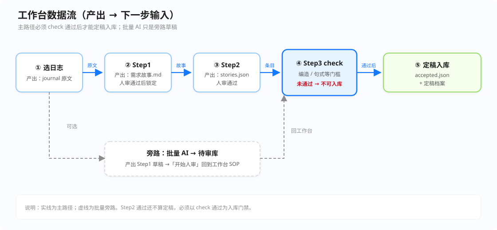

# 产品需求梳理智能体 · 操作手册（交付版）

> 面向**交付使用**。入口：**http://127.0.0.1:8765/**  
> 页内左侧「使用手册」与本文同步维护（侧栏目录 + 数据流）。

**版本要点：** 官方全量日志库 · Step3 **先 check 通过再定稿入库** · 打叉需确认 · 定稿人必填 · 「待审库」队列。

---

## 目录（快速定位）

1. [30 秒上手](#0-30-秒上手)
2. [数据流简图](#1-数据流简图每步产出--下一步输入)
3. [安装与启动](#2-安装与启动第一次)
4. [界面怎么读](#3-界面怎么读)
5. [怎么选日志](#4-怎么选日志交付关键)
6. [标准操作流程 SOP](#5-标准操作流程-sop)
7. [产物与路径](#6-产物与路径)
8. [故障排除](#7-故障排除)
9. [交付自检](#8-交付自检清单)

---

## 0. 30 秒上手

**Windows：** 双击 `start-with-ai.bat`（黑窗勿关）  
**Mac / Linux：** `./start-with-ai.sh`（首次先 `./setup.sh`）

1. 打开 http://127.0.0.1:8765/ ，登录（演示：`demo` / `demo1234`）
2. **日志库** → 选一条「聚焦摘录」→ 选用并去工作台  
3. Step1 通过 → Step2 通过 → **运行 check（须通过）** → 定稿归档  

正式交付：第 2 步改选**产品流 + 日期的全文**。

结项说明：[`结项说明-给审阅同事.md`](./结项说明-给审阅同事.md)。

---

## 1. 数据流简图（每步产出 → 下一步输入）



| 步骤 | 本步产出 | 交给下一步当输入 |
|------|----------|------------------|
| **选日志** | 当前 journal 原文 | Step1 对照与抽取的唯一依据 |
| **Step1** | 需求故事 `.md`（人审通过后锁定） | Step2 抽取「用户要…」的底稿 |
| **Step2** | `stories.json`（人审通过） | Step3 check + 定稿的条目源 |
| **Step3 check** | 编造 / 句式等门槛结果 | **通过后才允许**定稿入库 |
| **定稿归档** | `accepted.json` + 定稿档案 | 检索、复审、结项证据 |
| **批量 AI**（可选） | 待审库里的 Step1 草稿 | 「开始人审」→ 回到工作台 SOP |

原则摘要（来自功能全景）：

- **人两次把关**，AI 不得编造原文没有的能力  
- Step2 通过还**不算定稿**；必须 check 通过后再点定稿  
- 全程可追溯（`journal_id`、审核理由、`revisions`）

---

## 2. 安装与启动（第一次）

### 2.1 环境

1. Python 3.10+  
2. Windows：`setup阶段1环境.bat` · Mac/Linux：`./setup.sh`  
3. 复制 `project/.env.example` → `project/.env`，填 `AGNES_API_KEY`（勿提交 `.env`）

### 2.2 同步官方日志库

```bash
# Windows
project\.venv\Scripts\python.exe scripts\sync_journals.py
# Mac / Linux
project/.venv/bin/python scripts/sync_journals.py
```

### 2.3 日常启动

| 系统 | 怎么启动 |
|------|----------|
| Windows | `start-with-ai.bat` |
| Mac / Linux | `./start-with-ai.sh` |

数据：`project/data/product_requirement.db`（用户、审核历史、定稿档案、待审库）。

---

## 3. 界面怎么读

| 区域 | 作用 | 注意 |
|------|------|------|
| **工作台** | Step1→2→3 | 右侧显示产物字数；快速换日志选中后关窗 |
| **日志库** | 浏览 / 筛选 / 选用 | 速度：快&lt;1200 · 中1200–3499 · 慢≥3500 字 |
| **待审库** | 批量 AI 后排队 | 逐条审，不能一键全过 |
| **定稿档案** | 已定稿台账 | 与日志库原文不是一回事 |
| **审核历史** | 可读时间线 | 谁 / 何时 / 结论 / 理由 |

阶段显示：待开始 → Step1 待确认 → Step1 已锁定 → Step2 待确认 → Step3 待定稿（先 check）→ 已定稿。

---

## 4. 怎么选日志（交付关键）

| 目标 | 选什么 |
|------|--------|
| 试跑 / 拍视频 | **试跑/摘录**（字少） |
| 正式定稿 | **产品流 + 日期全文** |
| 会后纪要 | 粘贴或上传 `.md` |

换日志会清空未定稿产物（弹确认）。工作台「快速更换」选中后**自动退出窗口**。

---

## 5. 标准操作流程（SOP）

1. 填顶栏 **审核人**  
2. Step1：运行 → 对照 → 通过/打叉（都写理由）  
3. Step2：同上；可点右侧条目匹配左侧原文  
4. Step3：① **运行 check** → ② 通过后才可「生成定稿并归档」  
5. 在 **定稿档案** 核对  

**批量：** 日志库勾选 →「批量 AI → 待审库」→ 待审库「开始人审」→ 回工作台。

check 不通过 → **不允许**验收入库；改稿后须重新 check。

---

## 6. 产物与路径

相对 `project/trials/case-01/`：

| 文件 | 含义 |
|------|------|
| `output/requirement-story.md` | Step1 当前故事 |
| `output/stories.json` | Step2 条目 |
| `output/locked/step1-requirement-story.md` | Step1 锁定 |
| `output/locked/step2-approved.json` | Step2 已通过 |
| `output/accepted.json` | 定稿 |
| `output/session.json` | 会话元数据 |

---

## 7. 故障排除

| 现象 | 处理 |
|------|------|
| 页面打不开 | 黑窗是否在；重跑启动脚本 |
| 定稿按钮灰 / 提示先 check | 先跑 check；看错误改条目后再 check |
| 缺少 AGNES_API_KEY | 检查 `project/.env` |
| 日志库很少 | `scripts/sync_journals.py` |
| 8765 占用 | `scripts/free_port_8765.bat` |

---

## 8. 交付自检清单

- [ ] 启动后可登录，顶栏 AI 已配置  
- [ ] 日志库可按产品流 / 用途 / 速度（含字符范围）筛选  
- [ ] 摘录路径：Step1→2→**check 通过**→定稿全绿；check 失败时定稿被拒  
- [ ] 打叉须确认；换日志有清空提示  
- [ ] `accepted.json` 含 `revisions`、真实 `journal_id`、定稿人  

```bat
project\.venv\Scripts\python.exe scripts\verify_delivery.py
project\.venv\Scripts\python.exe scripts\verify_enterprise.py
```

期望 `FAIL=0`。

---

## 9. 与课题材料

| 文档 | 用途 |
|------|------|
| **本手册** + 页内「使用手册」 | **交付操作** |
| `docs/delivery-guide/项目功能全景说明.md` | 全景详解（本手册已压缩精华） |
| `docs/答辩总报告/` | 答辩 / 拍视频 |

对外只推：**本手册 + 启动脚本 + Web（8765）**。
