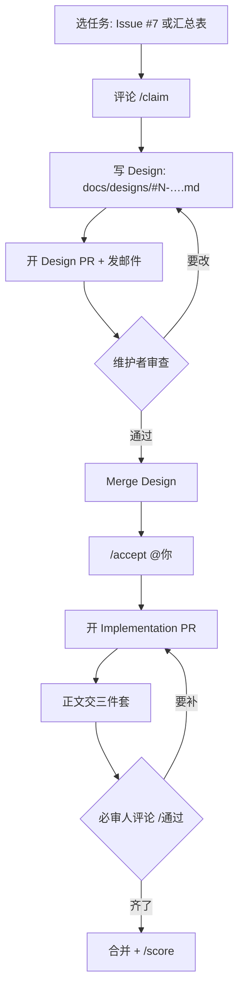

# 实训基地任务 · 新手上手（小白友好版）

> **给谁看：** 第一次用 GitHub 接实训任务的同学  
> **这篇是什么：** 《[实训基地协作指南.md](./实训基地协作指南.md)》的人话版 + 实战 walkthrough  
> **规则以谁为准：** [实训基地协作指南.md](./实训基地协作指南.md) · [任务贡献指南.md](./任务贡献指南.md)

**一句话机制：** `/claim` → Design PR → 维护者 Merge + `/accept` → Impl PR（代码+视频+截图）→ 必审人 `/通过` → 合并 → `/score`

| 项 | 链接 |
|----|------|
| 仓库 | https://github.com/hongwei-2026/product-requirement-loop |
| 总入口 | [Issue #7](https://github.com/hongwei-2026/product-requirement-loop/issues/7) |
| 汇总表 | [实训基地任务汇总表.md](./实训基地任务汇总表.md) |
| 维护者 | @hongwei-2026 · 邮件 `feizi_050920@qq.com` |

---

## 0. 先看流程图



**两个最容易误解的点：**

1. `/claim` **不会**立刻把任务写到你名下；要等 Design **已合并**，且维护者 `/accept @你` 后，汇总表「接取人」才会出现你。  
2. **一账号同时只能 1 个进行中任务**；也只能有 **1 个未关闭的 PR**。换题先 `/cancel`；开新 PR 前先关旧 PR。

---

## 1. 开始前准备 3 样东西

### 1.1 GitHub 账号

- 注册：https://github.com/signup  
- 记住用户名（后面 `/accept @用户名`、邮件里都要用）

### 1.2 Fork 本仓库（只需一次）

1. 打开 https://github.com/hongwei-2026/product-requirement-loop  
2. 右上角 **Fork** → Create fork（默认即可）  
3. 之后每次任务都在自己的 fork 里开**新分支**，再向 `hongwei-2026:main` 提 PR  

### 1.3 能收信的邮箱

Design 交上去后要发邮件通知维护者：`feizi_050920@qq.com`。

---

## 2. 选一道题

1. 打开 [Issue #7](https://github.com/hongwei-2026/product-requirement-loop/issues/7) 或 [汇总表](./实训基地任务汇总表.md)  
2. 找「接取人」为 `—` 的题  
3. 第一次建议 [#1](https://github.com/hongwei-2026/product-requirement-loop/issues/1)（简单、10 分，适合跑通全流程）  
4. **先读完 Issue 正文**（目标、交付物、验收）

难度参考：简单 10–15 · 中等 25–35 · 难 50–60 · 特难 70–90（以 Issue 为准）。

---

## 3. 实战：跟着 #1 走六步

### 第 1 步 · `/claim`

在 Issue 评论框**单独一行**：

```text
/claim
```

机器人会提示下一步。此时汇总表接取人仍为空，正常。

### 第 2 步 · 写 Design 文档

1. 在自己的 fork 打开 `docs/designs/_TEMPLATE.md`  
2. 新建：`docs/designs/#1-topbar-llm-summary.md`（格式：`#任务号-英文短名.md`）  
3. 填清：背景与问题 / 目标 / 方案摘要 / 影响面 / 验收标准  
4. **不要**塞完整实现代码（可放伪代码/接口草图）

### 第 3 步 · Design PR + 邮件

1. 分支：`design/#1-topbar-llm-summary`  
2. 向 `hongwei-2026:main` 开 PR，选模板 **Design**  
   - 标题：`[Design] #1 顶栏展示 LLM 摘要`  
   - 正文：`Related to #1`（**不要**写 `Fixes`）  
3. 邮件主题：`[Design] #1 <你的GitHub用户名>`  
   - 附：Issue 链接 · Design PR 链接 · GitHub 用户名  

### 第 4 步 · 等 `/accept`

维护者合并 Design 后会在 Issue 评论：

```text
/accept @你的GitHub用户名
```

之后汇总表才会写上你。**Design 未合并前不要催 `/accept`，也不要开实现 PR。**

### 第 5 步 · Implementation + 三件套

1. 分支：`feat/#1-topbar-llm-summary`  
2. PR 选模板 **Implementation**  
   - 标题：`[Impl] #1 顶栏展示 LLM 摘要`  
   - 正文：`Fixes #1`  
3. 正文必须有「三件套」：  
   - 代码（本 PR）  
   - **可公网**演示视频链接  
   - 截图 **≥ 2** 张（直接贴正文）  
4. 禁止 Key / `.env` 进代码、截图、视频  

### 第 6 步 · 必审 `/通过` → 合并 → 计分

1. 必审人在 PR 评论单独一行发 `/通过`（全员通过后门禁绿）  
2. 检查全绿后维护者合并  
3. 维护者在 Issue：`/score 10`（按质量微调）  
4. 若被要求补材料：补完后 PR 评论 `/recheck`

---

## 4. FAQ

| 问题 | 答案 |
|------|------|
| `/claim` 了汇总表怎么还没我？ | 要等 Design 合并 + `/accept @你` |
| 能同时接两道题吗？ | 不能；先 `/cancel` |
| 能同时开多个 PR 吗？ | 不能；同一账号只允许 **1 个未关闭 PR** |
| Design 未合能开实现 PR 吗？ | 不能；`task-lock` 会拦 |
| 一个月没更新会怎样？ | 关联 PR 超 30 天无更新 → 自动释放 |
| `Fixes` 和 `Related to`？ | Impl 用 `Fixes #N`；Design 用 `Related to #N` |
| 检查红了怎么办？ | 看检查名（如缺视频），补齐后 `/recheck` |

---

## 5. 命令速查

| 命令 | 发在哪 | 谁能用 | 作用 |
|------|--------|--------|------|
| `/claim` | 任务 Issue | 登录用户 | 登记意向 |
| `/accept @用户` | 任务 Issue | 仅维护者 | Design 合并后锁定接取人 |
| `/cancel` `/release` | 任务 Issue | 认领人/维护者 | 放弃 |
| `/reject-claim` | 任务 Issue | 仅维护者 | 强制清空 |
| `/score N` | 任务 Issue | 维护者/必审人 | 计分 |
| `/通过` `/approve` | **PR 评论** | 必审人 | 同意当前 head |
| `/驳回` | **PR 评论** | 必审人 | 反对/撤回 |
| `/recheck` | PR 评论 | 作者/必审人 | 重跑企业级检查 |

---

## 6. 遇到问题找谁

| 情况 | 找谁 |
|------|------|
| 机制 / 命令 / 权限 | @hongwei-2026 |
| Design 提交通知 | 邮件 `feizi_050920@qq.com` |
| 内容审查 | 必审人：@hongwei-2026 · @hl019 · @Jerrybao99 · @likexin105 |
| 找任务 / 看进度 | Issue #7 · 汇总表 · 仪表盘 |

---

*小白友好版 · 规则变动以《实训基地协作指南》《任务贡献指南》为准。*
