# 产品需求梳理智能体 · 功能全景说明（故事版）

> 本文用**人话**把产品从头到尾讲清楚：为什么要做、每一屏干什么、按钮按下去会发生什么、最后东西落在哪里。  
> 配图均为本机 `http://127.0.0.1:8765/` 实机截图（演示账号 `demo`）。  
> 服务启动：仓库根目录双击 `start-with-ai.bat`，勿关黑色服务窗口。

---

## 开篇：这个工具要解决什么麻烦

产品研发每天都在写「研发日志」：有的很长，有的很碎，有的写得像日记。开评审会时，大家真正需要的不是把日志再念一遍，而是：

> **用户到底要什么？**  
> 有没有编造原文没有的能力？  
> 谁拍的板？能不能以后查回来？

这个产品就是把这件事做成一条固定流水线：

1. 先从官方仓库或本机**拿到日志原文**；
2. AI 帮你整理一稿；
3. **人必须自己看、写理由**，通过或打叉；
4. 人再点定稿；
5. 最后进「定稿档案」，以后能搜、默认不必重审。

一句话原则：

**电脑可以帮忙写，最后拍板的是人。**

---

## 全流程总图（先看懂地图再进房间）

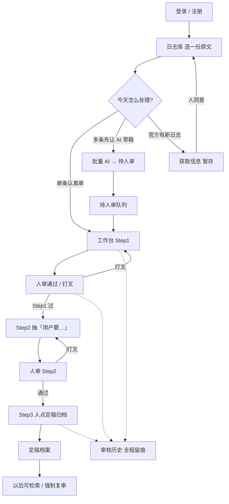

下面按「真实会点到的左边菜单」一间间房间讲完：每间都有**开头（你为什么进）→ 过程（怎么点）→ 结尾（东西去哪了）**。

---

## 第一章：登录 —— 先认人，再记账

### 开头

如果不登录，审核记录不知道记在谁头上。以后出了问题：「谁说这句话可以过的？」就说不清。所以第一道门是登录。

### 过程（细节）

打开 `http://127.0.0.1:8765/`，通常会先到登录页。

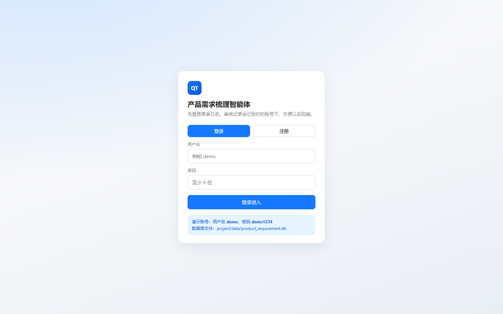

你会看到：

| 元素 | 干什么 |
|------|--------|
| **登录 / 注册** 两个页签 | 老用户登录；新用户可注册（要填显示名，审核历史里显示这个名字） |
| **用户名 / 密码** | 演示账号：`demo` / `demo1234`（页面底部蓝框也写了） |
| **登录进入** | 成功后跳进产品首页（工作台） |
| 底部提示 | 数据库文件在 `project/data/product_requirement.db`——用户、会话、审核、定稿都在这儿 |

填好演示账号后点登录：

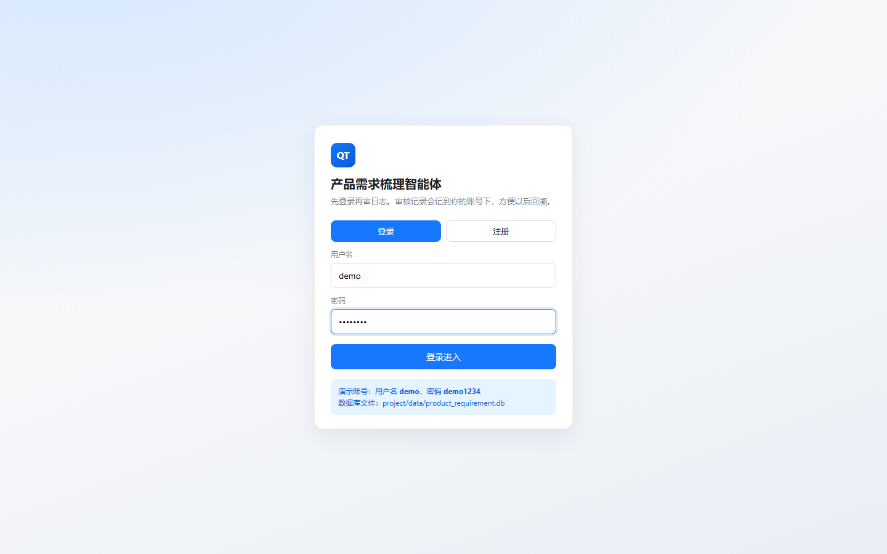

### 结尾

登录成功 → 左侧最底下会出现「演示账号」和 **退出登录**。  
之后你在工作台点的「通过 / 打叉 / 定稿」，都会挂在这个账号下，审核历史能查。

若你点 **退出登录**：会话清掉，再进产品又要登录。这不是装饰，是为了多人共用一台电脑时别串账。

---

## 第二章：左边导航 —— 七个入口各管一段人生

登录后主界面左边是深色栏。这不是「几个差不多的列表」，而是**整条流水线的站点**：

| 入口 | 它管什么 | 常见误会 |
|------|----------|----------|
| **工作台** | 真正审一篇：看原文、看 AI 稿、点通过/打叉/定稿 | 以为左边流水线 1/2/3 是另一套日志——不是，那只是进度灯 |
| **日志库** | 全部可选原文（产品流 × 日期） | 以为「选进日志库」就等于定稿——不等于 |
| **获取信息** | 从官方 GitHub 拉新日志到**暂存** | 以为拉取就自动进日志库——要人点「同意」 |
| **待人审** | AI 批量写完草稿后排队等人 | 以为可以一键全过——不行，仍要一条条写理由 |
| **审核历史** | 按「一份日志一行」回溯谁做了什么 | 以为没定稿就消失——不会，会标「现在在哪」 |
| **定稿档案** | Step3 定稿后的正式结果台账 | 和「日志库」搞混——日志库是原文，这里是审完的结果 |
| **使用手册** | 产品内白话说明 + 截图 | — |

顶部还有：当前用的模型名、**使用手册**按钮、以及「从上一页返回」——从工作台跳到日志库后，不必每次重新找「工作台」。

---

## 第三章：工作台 —— 故事的主战场

### 开头

你选好一份日志后，真正干活的地方就是工作台：左边原文，右边电脑整理结果，底下是你的决定。

刚进来、还没选日志时，中间会提醒你先去日志库：


选好一份「试跑摘录」后，典型样子是：


### 过程：四个状态灯

工作台上方有四个小格子，要养成「先看灯再动手」：

| 灯 | 含义 |
|----|------|
| **当前阶段** | 待开始 / Step1 待确认 / Step1 已锁定 / Step2 待确认 / 待定稿 / 已定稿… |
| **反馈轮次** | 你打叉重跑了几次 |
| **故事条数** | Step2 抽出了几条「用户要…」 |
| **锁定** | Step1 通过后会锁定；想重做 Step1 要点「解锁 Step1」 |

### 过程：Step1 —— AI 整理「需求故事」

1. 顶栏旁 **审核人** 填你的名字（演示账号会预填「演示账号」）。
2. 点蓝色 **运行 Step1（AI 整理故事）**。
3. 等转圈结束：右边出现一篇「这件事是什么」的需求故事。
4. **对照左边原文**看：有没有瞎编？有没有把好几件事揉成一团？
5. 决定：
   - **对了**：点绿色「通过」→ 在理由框写一句人话（必填）→「确认提交并继续」。
   - **错了**：点红色原因之一——编造 / 分层 / 漏了 / 格式 / 其他 → 写清楚错在哪 → 确认。系统只重跑当前步，不会偷偷把后面也改掉。

Step1 通过后：

- 故事被**锁定**；
- 你可以继续跑 Step2；
- 也可以点 **解锁 Step1**（会清掉后面 Step2 产物，因为地基变了）。

### 过程：Step2 —— 拆成「用户要…」条目

1. 点运行 Step2（或从待人审进来后手动跑）。
2. 右边变成一张张卡片：「用户要……」。
3. **人审对照工具（不是 AI）**：点右边卡片 → 左边原文会滚到相关段落并高亮（黄/蓝/绿表示匹配强弱）。用来帮你核对「这句话原文里有没有」，最终对不对仍由你拍板。
4. 同样：通过写理由，或打叉选原因码写理由。

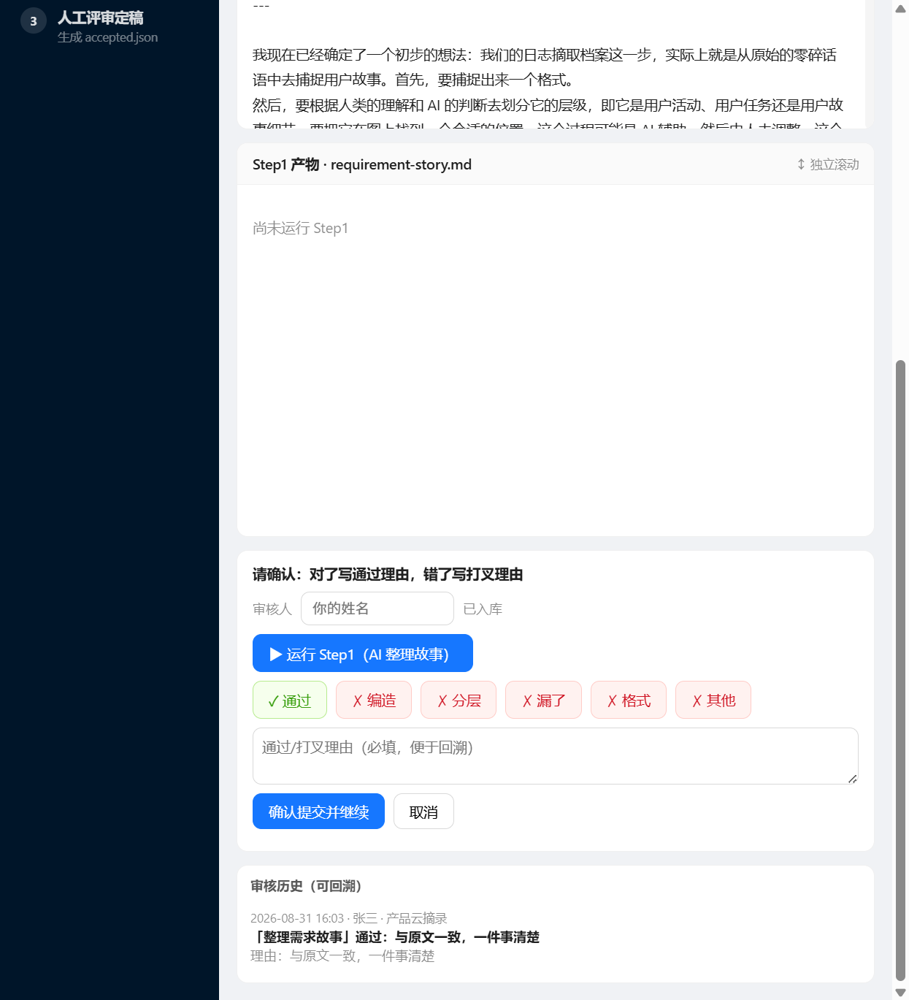

### 过程：Step3 —— 定稿归档（最容易被跳过的一步）

很多人以为「Step2 点通过了」就入库了——**没有**。

页面会明确写：

> Step1/Step2 人审通过还不算定稿。必须点「生成定稿并归档」，才会出现在「定稿档案」。

你要做的：

1. 确认 **定稿人** 姓名；
2. 点 **生成定稿并归档**；
3. 再点 **运行 check 验收**（查编造、格式等门槛）；
4. 成功后会打开「定稿档案」列表，并能点开详情。

### 结尾（工作台这条线收束）

| 你的动作 | 结果落点 |
|----------|----------|
| 只跑了 AI、没人审 | 产物在本机会话目录，审核历史有记录，但**不在定稿档案** |
| Step1/2 人审过了，没点定稿 | 阶段停在「待定稿」；审核历史标「未定稿」；定稿档案没有 |
| 点了定稿 | `accepted.json` + 定稿档案台账；日志库卡片可显示「已定稿」 |

工作台其它按钮：

- **打开日志库 / 快速更换**：换日志会清空未定稿产物（有确认框）。
- **看本轮摘要**：原文很长时，可单独看本轮关注摘要。
- **查看本日志审核历史**：跳到这条日志的阶段时间线。

---

## 第四章：日志库 —— 书架，不是保险箱

### 开头

日志库像书架：所有能拿来审的原文都在这里。你进来是为了**挑今天只梳理的一件事**，不是来「自动定稿」。


### 过程（每一个控件）

**上方统计**

- 日志总数、产品流数量、正式全文数、自定义数——一眼知道库有没有同步全。

**筛选条（要会用）**

| 筛选 | 用途 |
|------|------|
| 产品流 | 产品云 / 研运云 / 课堂… 按业务线缩小范围 |
| 用途 | **试跑/摘录**=字少验证；**正式全文**=按日完整日志定稿用；**自定义**=粘贴/上传 |
| 定稿状态 | **已定稿 / 未定稿**（指有没有进「定稿档案」，不是「有没有进日志库」） |
| 速度 | 快/中/慢（大致按字数） |
| 搜索 | 标题 / 产品流 / 日期 |

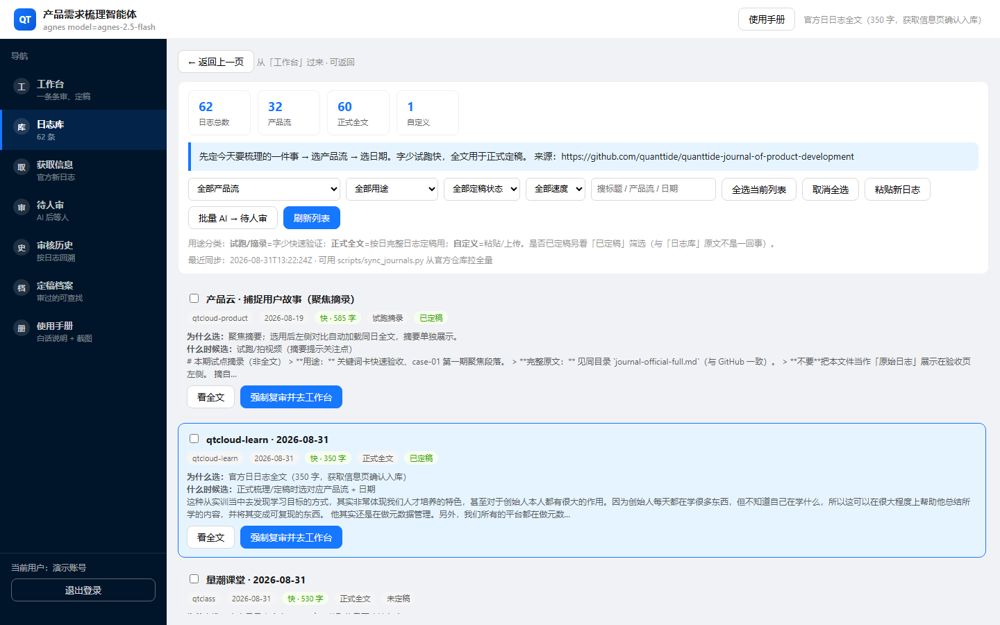

**列表卡片上你会看到**

- 标题、产品、日期、字数、用途标签；
- **已定稿 / 未定稿** 徽章；
- 「为什么选它 / 什么时候选」的提示文案；
- **看全文**：只预览，**不进工作台、不强制复审**；
- **选用并去工作台**（若已定稿则变成 **强制复审并去工作台**）。

点卡片预览全文时：

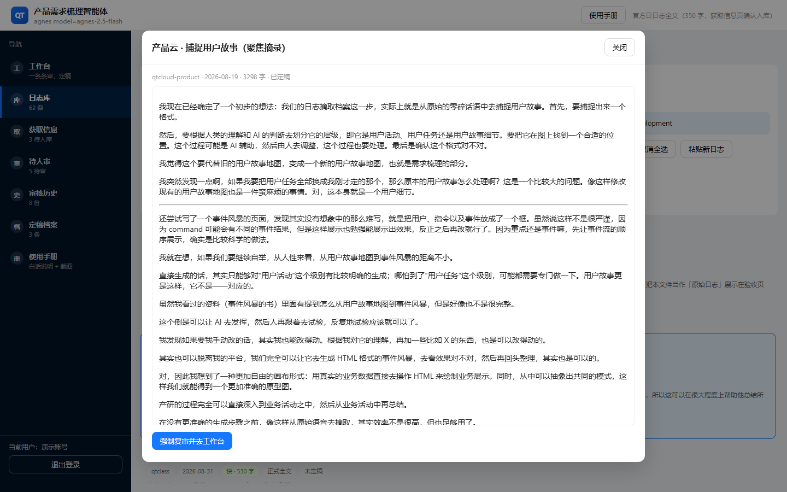

关掉预览就停在日志库——这是刻意设计：避免「手滑点一下就被拽去复审」。

**批量相关按钮**

| 按钮 | 过程 | 结尾 |
|------|------|------|
| 全选 / 取消全选 | 勾选当前列表 | 为批量 AI 做准备 |
| **批量 AI → 待人审** | 勾选多条后点它；AI **只先写 Step1 需求故事** | 条目进入「待人审」，**不会**自动过 Step2、更不会定稿 |
| 粘贴新日志 | 贴会议纪要等 | 进自定义库，再选用到工作台 |
| 刷新列表 | 重新读本地 journals + 台账状态 | — |

### 结尾

- 选用成功 → 工作台左边出现原文，阶段通常回到「待开始」或提示已有定稿。
- 已定稿日志默认不必重审；真要重做 → **强制复审**（会清空工作台产物，有确认）。
- 日志库里的「已定稿」= 定稿档案里有记录；和「获取信息同意写入日志库」不是一回事。

---

## 第五章：获取信息 —— 官方新货先暂存，人点头再上架

### 开头

官方研发日志仓库会持续更新。产品不会傻乎乎「一拉取就盖掉你的库」，而是：

> **获取 ≠ 写入日志库**

先拉到暂存箱，高度相似的自动取消，其余等人勾选同意或拒绝。

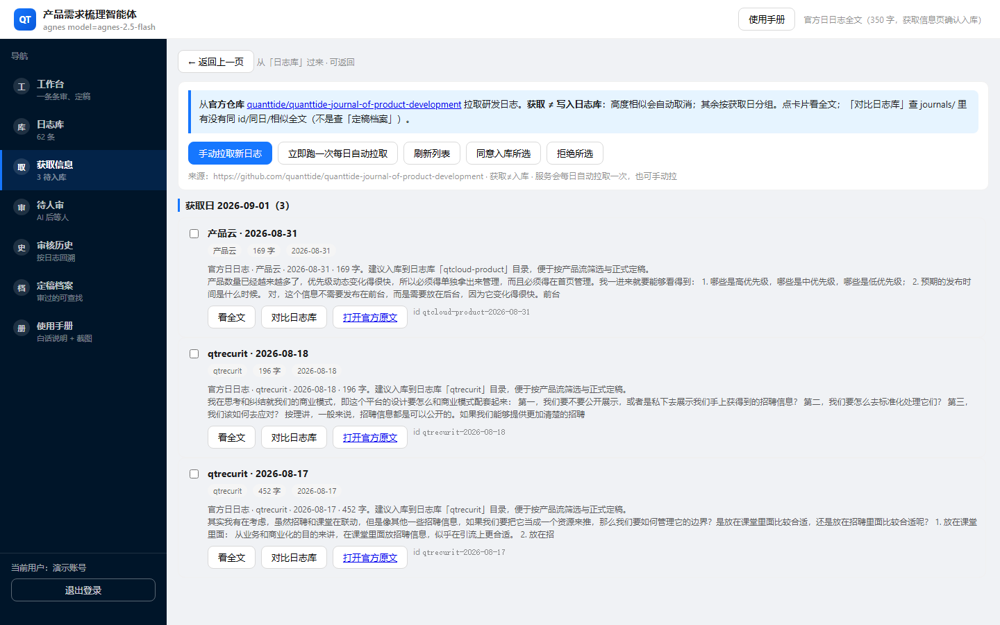

### 过程

| 按钮 | 细节 |
|------|------|
| **手动拉取新日志** | 立刻从官方仓库拉一批到暂存 |
| **立即跑一次每日自动拉取** | 触发与每日任务相同的逻辑（服务常开时也会自动跑） |
| **刷新列表** | 只刷新暂存列表显示 |
| **同意入库所选** | 把勾选的暂存项写入 `journals/`（日志库），符合产品流×日期规范 |
| **拒绝所选** | 丢掉这些暂存候选 |

每张暂存卡片可以：

- 点开看**全文预览**；
- 点 **对比日志库**：查 `journals/` 里有没有同 id / 同日 / 相似全文。

注意文案里反复强调：对比的是**日志库原文**，**不是**「定稿档案」。

### 结尾

| 你的选择 | 结果 |
|----------|------|
| 同意 | 日志库多了条目，可以去选用、批量 AI |
| 拒绝 / 相似取消 | 不会进日志库 |
| 只拉取不点同意 | 一直停在获取信息暂存，工作台审不到 |

---

## 第六章：待人审 —— AI 打草稿，人来盖章

### 开头

日志很多时，你不想一条条从工作台点「运行 Step1」。可以在日志库勾选后批量让 AI 先写。写完它们会排在「待人审」。

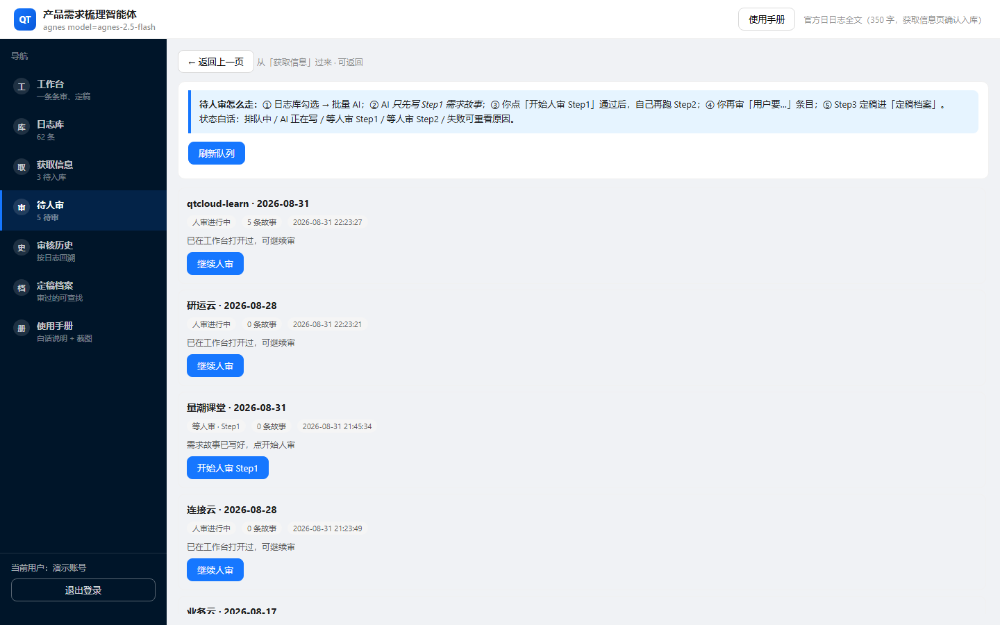

### 过程（队列状态要认得）

常见状态（界面中文）：

| 状态 | 你该做什么 |
|------|------------|
| 排队等 AI / AI 正在写 | 等，刷新 |
| **等人审 · Step1** | 点「开始人审 Step1」→ 进工作台审需求故事 |
| Step1 已过 · 等人点 Step2 | **不会自动跑 Step2**；打开后你自己点运行 Step2，或解锁 |
| 等人审 · Step2 | 审「用户要…」 |
| 人审进行中 | 之前打开过，可继续 |
| 已进定稿档案 | 这条队列生命周期结束 |
| 失败 | 看错误，可重开或回日志库 |

页面上方指南把顺序写死了：

1. 日志库勾选 → 批量 AI；  
2. AI 只先写 Step1；  
3. 你审过 Step1 后，**自己**再跑 Step2；  
4. 再审条目；  
5. Step3 定稿进定稿档案。

### 结尾

待人审**不是终点**。终点永远是：人在工作台写完理由 → 人点定稿 → 定稿档案。  
队列只是「别让 AI 草稿丢在地上」。

---

## 第七章：审核历史 —— 没定稿也不会人间蒸发

### 开头

有人怕：「我审到一半关掉，是不是没了？」  
审核历史回答：按**一份日志一行**汇总，告诉你**现在在哪**。

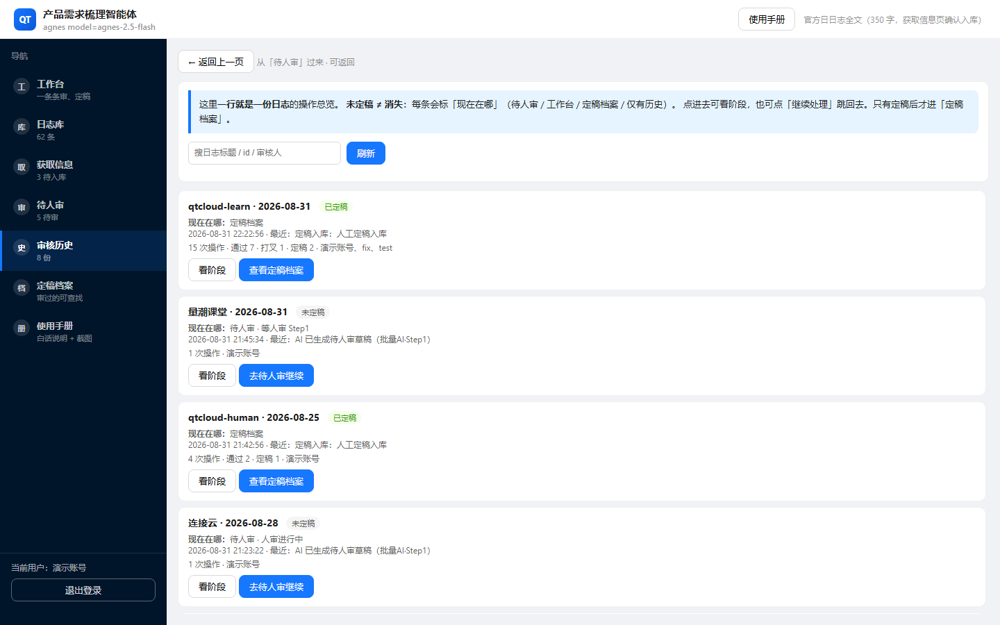

### 过程

列表上每条大致有：

- 日志标题；
- 徽章：**已定稿 / 未定稿**；
- **现在在哪**：待人审 / 工作台 / 定稿档案 / 仅有历史；
- 最近一次操作摘要、通过/打叉次数、定稿次数、参与人；
- **看阶段**：打开时间线；
- **继续处理**：跳到待人审 / 工作台 / 定稿档案。

点「看阶段」：

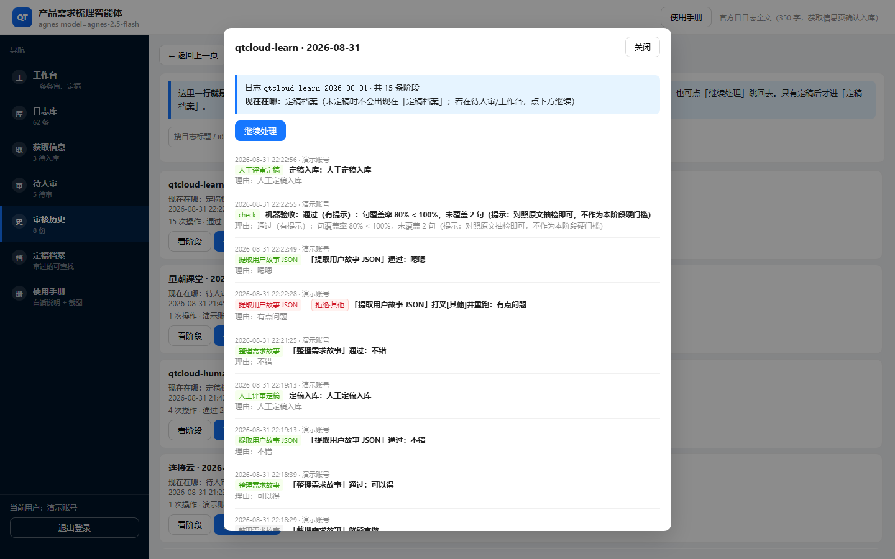

时间线里能看到：谁、何时、Step1/Step2/定稿/check、理由原文。这就是「可追溯」四个字的实体。

### 结尾

- 未定稿 → **不会**出现在定稿档案，但审核历史还在，并可「继续处理」。  
- 已定稿 → 「现在在哪」显示定稿档案，可点进去看结果。  
- 所以：审核历史是「过程账本」；定稿档案是「结果保险箱」。

---

## 第八章：定稿档案 —— 审完的结果，不是原文库

### 开头

名字特意叫「定稿档案」，就是为了避免和「日志库」打架：

| | 日志库 | 定稿档案 |
|--|--------|----------|
| 装什么 | 研发日志原文 | Step3 定稿后的需求结果 |
| 何时出现 | 同步 / 获取同意 / 粘贴 | 人点「生成定稿并归档」之后 |
| 能不能当原文再审 | 能（选用 / 强制复审） | 主要是查阅；复审仍从日志库/强制复审走 |

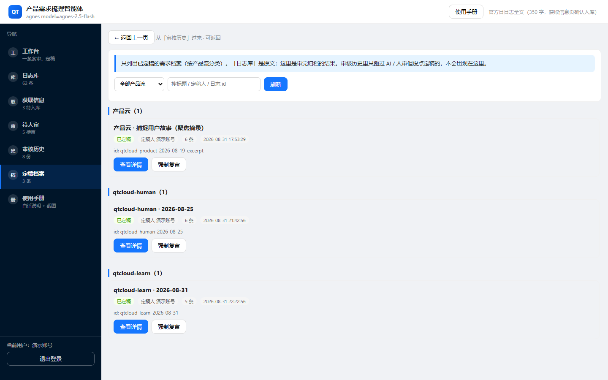

### 过程

- 按**产品流**分组；
- 可按产品筛选、搜标题 / 定稿人 / 日志 id；
- 卡片上有：已定稿徽章、定稿人、条数、时间；
- **查看详情**：定稿了哪些「用户要…」、当时审核阶段；
- **强制复审**：清空工作台并用该日志重开。

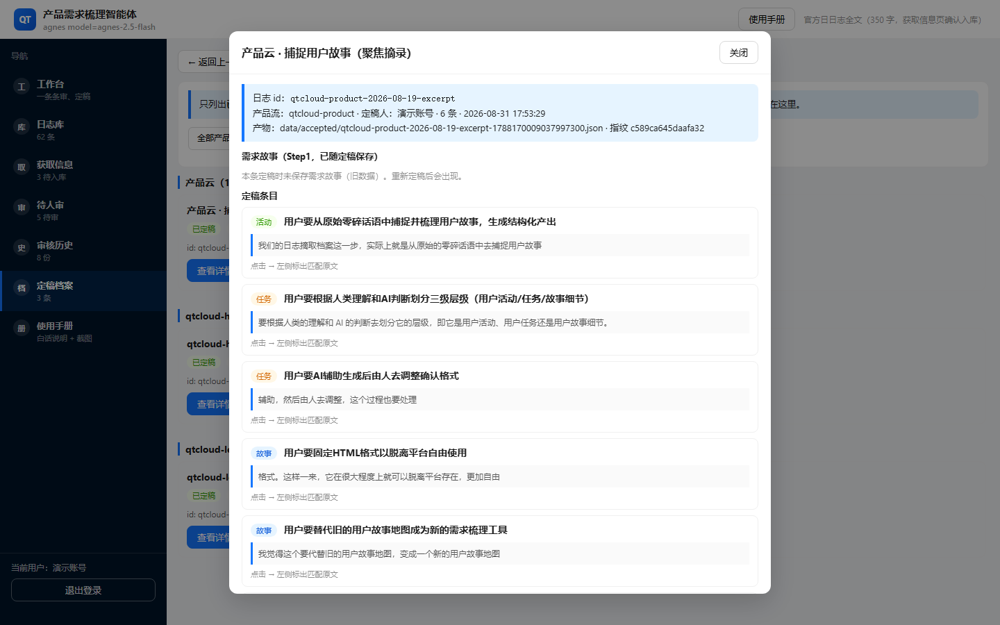

### 结尾

定稿成功的完整闭环是：

```text
原文（日志库）
  → AI + 人审 Step1/Step2
  → 人点「生成定稿并归档」
  → 定稿档案可检索
  → 日志库卡片标「已定稿」
  → 审核历史标「定稿档案」
```

若你只做到 Step2 通过就停手——**故事没有结尾**，定稿档案是空的。这正是产品要你养成的习惯：结尾必须有人签字定稿。

---

## 第九章：使用手册 —— 产品里的说明书

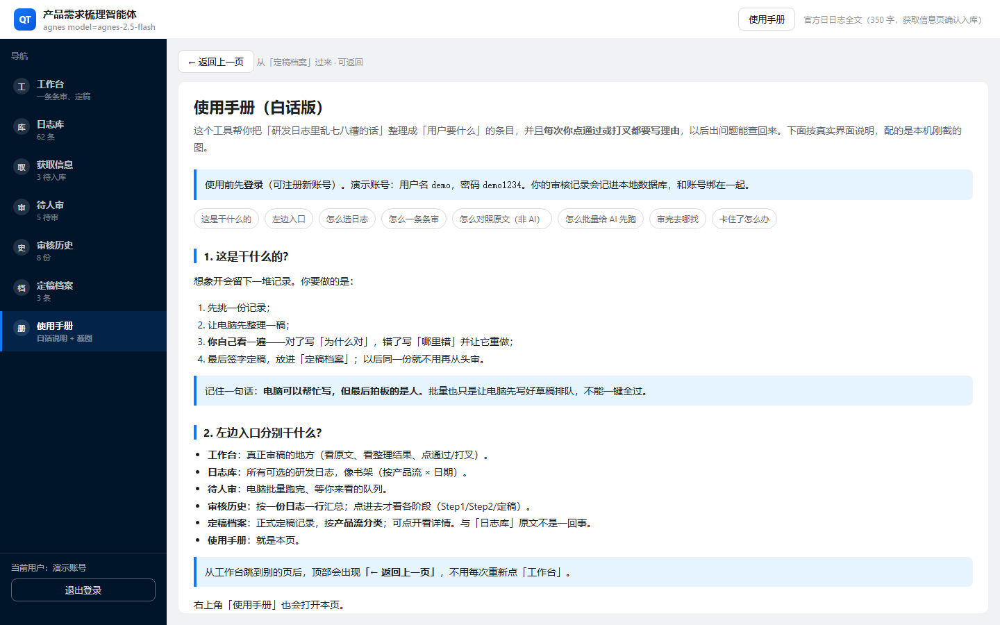

左侧进「使用手册」，或右上角按钮，内容与交付文档一致：白话步骤、配本机截图。适合新人第一次上手，或答辩前快速过一遍。

---

## 第十章：把「一天」讲成完整故事（过程 + 结尾）

下面用一条虚构但符合真实按钮的故事，把**开头—过程—结尾**钉死。

### 开头

小张早上要交一份「产品云」需求梳理。他打开 `start-with-ai.bat`，浏览器进登录页，用演示账号登录。

### 过程

1. **获取信息**：点「手动拉取」，发现有一条新日志和库里很像，系统标了取消；另两条他勾选后点「同意入库所选」——现在日志库多了货。  
2. **日志库**：筛「产品云」+「正式全文」+「未定稿」，点开「看全文」确认是今天要的那篇；再点「选用并去工作台」。  
3. **工作台 Step1**：填审核人 → 运行 Step1 → 对照原文 → 写「和原文一件事对得上」→ 通过。  
4. **Step2**：运行 → 点每条「用户要…」看左边高亮 → 发现一条像编造，点「编造」写理由 → AI 重跑 → 再通过。  
5. **Step3**：填定稿人 → **生成定稿并归档** → check 通过。  
6. **定稿档案**：列表里出现该条；点详情能看到故事与条目。  
7. **审核历史**：同一行显示「定稿档案 / 已定稿」，过程理由都在。

若日志很多：他在日志库勾 5 条 → 批量 AI → 去 **待人审** 一条条「开始人审」，仍然走 3～5，没有「批量一键全过」。

### 结尾（这一天真正结束的标志）

不是「AI 跑完了」，也不是「我点过通过了」，而是：

1. 定稿档案里找得到；  
2. 日志库徽章是「已定稿」；  
3. 审核历史能回答「谁、何时、凭什么理由」。

三件事齐了，这一天的故事才有结尾。

---

## 附录 A：功能清单（自检用）

| # | 功能 | 你是否用过 | 结尾落点 |
|---|------|------------|----------|
| 1 | 登录 / 注册 / 退出 | | 会话与账号绑定 |
| 2 | 工作台左右对照 + 独立滚动 | | — |
| 3 | Step1 运行 / 通过 / 打叉 / 解锁 | | 锁定故事或重做 |
| 4 | Step2 运行 / 通过 / 打叉 / 点卡片对照原文 | | 条目可定稿 |
| 5 | Step3 定稿归档 + check | | 定稿档案 |
| 6 | 日志库筛选 / 预览 / 选用 / 强制复审 | | 工作台载入原文 |
| 7 | 粘贴新日志 | | 自定义库 |
| 8 | 批量 AI → 待人审 | | 队列 |
| 9 | 获取：拉取 / 同意 / 拒绝 / 对比日志库 | | journals 或丢弃 |
| 10 | 待人审开始人审 / 继续 | | 工作台 |
| 11 | 审核历史看阶段 / 继续处理 | | 回到正确站点 |
| 12 | 定稿档案检索 / 详情 / 强制复审 | | 查阅或重开 |
| 13 | 返回上一页 / 使用手册 | | 导航与自学 |

---

## 附录 B：产物与数据（给要查文件的人）

相对 `project/trials/case-01/`（会话产物）与 `project/data/`（库）：

| 路径 | 含义 |
|------|------|
| `output/requirement-story.md` | 当前 Step1 故事 |
| `output/stories.json` | 当前 Step2 条目 |
| `output/accepted.json` | 定稿结果（含 revisions、journal_id） |
| `project/journals/` | 日志库原文 |
| `project/data/product_requirement.db` | 用户、审核事件、定稿台账、队列 |
| `project/data/journal_inbox/` | 获取信息暂存 |

`.env`（API Key）**不要**提交到 GitHub。

---

## 附录 C：截图目录

本文配图目录：`docs/delivery-guide/assets/`  

重新截图可运行（需服务已启动）：

```bat
cd screenshots
node capture_feature_guide.mjs
node _cap15.mjs
```

---

## 收束

这个产品不是「一键把日志变成需求」的魔术，而是一条**强制留痕的人机流水线**：

- **日志库 / 获取信息**管原文从哪来；  
- **工作台 / 待人审**管人怎么把关；  
- **审核历史**管过程怎么查；  
- **定稿档案**管结果怎么收场。

你只要记住故事的最后一句：

**没点「生成定稿并归档」，故事就还没写完。**
