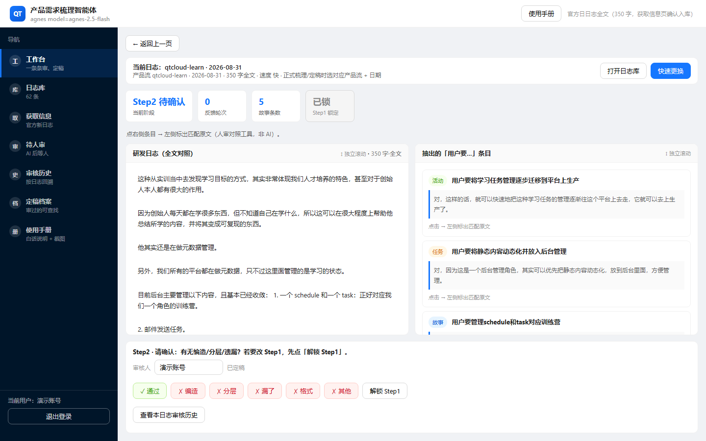
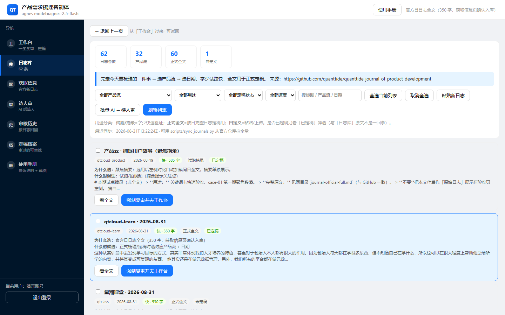
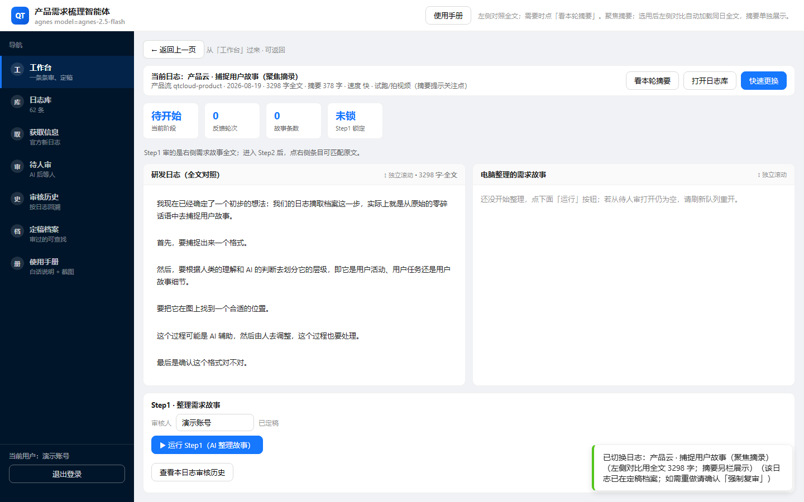

# 课题初审意见（试跑·自评）

| 项 | 内容 |
|----|------|
| 课题叫什么 | 产品需求梳理智能体（把研发日志整理成「用户要……」） |
| 谁做的 | 于鸿伟 |
| 这份意见是谁写的 | 我自己按实训基地标准先审一遍（试跑流程） |
| 日期 | 2026-09-04 |

> 审的时候就盯三件事：当初答应做的有没有做完；验收标准有没有对上；**同事拿过来，能不能真的用起来。**

---

## 一、先说结论

### 结论是什么？

**可以往下走，但还差几样东西要补。**  
（书面说法叫「有条件通过」——意思不是「不合格」，也不是「完美过关」，而是：**大方向过了，补完下面那几条，才算正式过。**）

### 用人话讲一遍

这个工具已经能跑：日志能选、AI 能整理、人能点「通过/打叉」、最后能定稿留底。  
但同事如果电脑还没装环境、也没有 AI 钥匙，打开就会卡住。所以现在不能说「谁拿来都能用」，只能说「配好环境的人能用；再补几页说明，别人才不容易踩坑」。

### 为什么给这个结论（四句话）

1. **当初答应做的核心东西，都做出来了。**  
2. **用正确的原文去验，机器检查是绿的（没有瞎编）。**  
3. **环境准备好以后，核心流程能走通。**  
4. **还没做到「双击就能用」**——缺一把钥匙、要在自己电脑上装一遍；说明书里几处容易让人误会。

### 要补什么（补完就能当正式通过）

请在 **3 个工作日**内补下面这些（不用重做整个课题）：

| # | 补什么 | 补到什么程度算够 |
|---|--------|------------------|
| 1 | 一页纸：《同事 10 分钟上手》 | 写清：双击哪个文件、演示账号是啥、没钥匙时能看什么、黑窗口报错怎么办 |
| 2 | 在 README 最上面写清「怎么验才算对」 | 验的时候必须用对的那份日志原文；「覆盖率」不是数字死磕 100%，而是「有出处 + 没覆盖到的说清楚」 |
| 3 | 写一段「用错文件会怎样」 | 故意用错原文去验，会变成「全是编造」——提醒别人别踩这个坑 |
| 4 | （建议）录一段 3～5 分钟操作视频 | 从登录点到定稿，证明不是只靠截图糊弄 |

### 别人想复验，就跑这一句

```bat
project\.venv\Scripts\python.exe project\check.py project\trials\case-01\output\accepted.json --source project\trials\case-01\input\active-journal.md --strict
```

正常结果：退出成功，编造条数 = 0。

---

## 二、当初答应做的，做完了吗？

先看背景，不然不知道这课题在补什么洞。

量潮产品云那边，早就写了：要从研发日志里抓「用户要……」：


可是工程这边，同名的东西当时**只有一页说明书，没有能真正跑起来的程序**：


所以我当初答应做的，其实就是：**把说明书变成能用的流水线。**

| 当初答应什么 | 现在怎样 | 怎么证明 |
|--------------|----------|----------|
| 写清楚流水线图纸（几步、谁做、产出什么） | **做完了** | 仓库里有图纸文件 |
| 能真正跑一轮试点，并且中间至少停一次让人改意见 | **做完了** | 试点目录里有完整产物；报告里写了停了 3 次，其中有一次是打回去重做 |
| 做自动检查：别让 AI 瞎编 | **做完了** | 检查脚本对正确原文跑过，结果通过、编造 = 0 |
| 试点材料齐全（输入、输出、定稿、报告） | **做完了** | 文件夹都在 |
| 写说明书，让别人能跟着做 | **做完了，而且还多做了** | 有操作手册；还做了带界面的网页版 |
| 不做的事：不接飞书、不做进数据库那一步 | **按约定没做**；但网页界面反而多做了 | 多做界面是好事，方便同事点着玩；不算「没兑现承诺」 |

图纸是照着官方成熟模板写的，不是自己瞎发明：


**这一节一句话：** 答应的核心都交了；网页版是加餐。

---

## 三、验收标准对上了吗？

审的时候只看已经交出来的材料和本机再跑一遍检查，不靠想象。

人怎么验 AI，一开始就定死了：**左边是原文，右边是 AI 整理的，下面人说行或不行。**


| 当初写的门槛 | 过没过 | 依据（人话） |
|--------------|--------|--------------|
| AI 不能瞎编（编造条数必须是 0） | **过了** | 用对的原文再检查：编造 = 0 |
| 每条「用户要……」都要能在原文里找到出处 | **过了** | 7 条都能对上原文句子 |
| 「覆盖率」要说得清 | **按我们写明的口径过了** | 数字上大约覆盖了四成句子——口语日志不可能句句都变成需求；没变成需求的句子单独记了，并有人写过「可以接受」。**注意：如果拿错原文文件去验，会误报成「全是编造」** |
| 中间至少让人停一次提意见 | **过了** | 实际停了 3 次，其中有一次打回去改 |
| 定稿里每条都有人批准，还有修改痕迹 | **过了** | 定稿文件里能看到 |
| 试点该有的文件都在 | **过了** | 故事稿、条目、定稿、锁定备份、未覆盖说明、试点报告都有 |

AI 第一步先把乱七八糟的日志讲成「一件事」：


真跑的时候不是一次过，中间有打回重做：


本机再验一遍（2026-09-04）：

```
故事 7 条
编造 0 条
覆盖大约 40%（没盖到的有说明）
检查通过
```

**这一节一句话：** 用对文件去验，是过关的；用错文件就会误判，所以说明书一定要写清。

---

## 四、同事真的能用起来吗？

我按操作手册的顺序走了一遍：**登录 → 选日志 → 工作台审 → 通过或打叉 → 定稿存档。**

**能不能进门？** 能。演示账号写在登录页上：`demo` / `demo1234`。


**主界面在哪？** 双击启动后打开浏览器，进来就是工作台。



**日志从哪选？** 左边进「日志库」，挑一条官方日志或试跑用的短摘录。



**选完能不能对着原文看？** 能。左边原文，右边 AI 写的，可以对照。



**人能不能拦住 AI 胡说？** 能。点「通过」或「打叉」都要写理由；打叉只重做当前这一步，不用从头来。


**定稿之后还能找回吗？** 能。进「定稿档案」可以以后再查。


把上面走读收成一张表：

| 我想问的 | 答案 |
|----------|------|
| 有没有一键启动？ | **有**，双击启动脚本，浏览器打开本地页面 |
| 有没有现成账号？ | **有**，`demo` / `demo1234` |
| 有没有说明书？ | **有**，操作手册还带图 |
| 第一次、啥都没装，能不能马上用？ | **基本不行**——要先装运行环境，还要配一把 AI 钥匙。这是现在最大的拦路虎 |
| 环境弄好了，核心流程能不能走完？ | **能**：选日志 → AI 整理 → 人点头 → 再抽条目 → 人再点头 → 定稿 → 机器再查一遍 |

**会卡在哪：**  
① 电脑没配好 / 没有 AI 钥匙；  
② 只能在自己电脑上用，没法大家共用一个网上地址；  
③ 验的时候容易拿错原文文件；  
④ 「覆盖率」几个字容易让人以为必须数字拉满 100%。

**这一节一句话：**  
环境弄好了，同事能用起来；现在还做不到「拿到电脑双击就完事」。

---

*图片都在：`docs/初审/assets/`*  
*这是实训基地初审流程的试跑：我自己审自己，标准不放水。*
