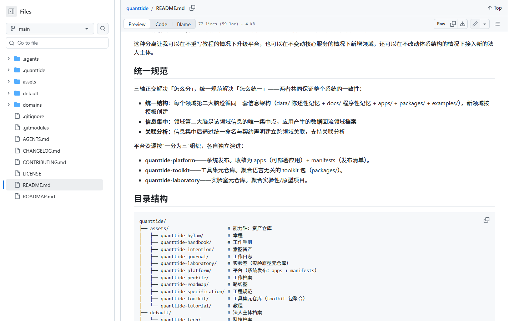
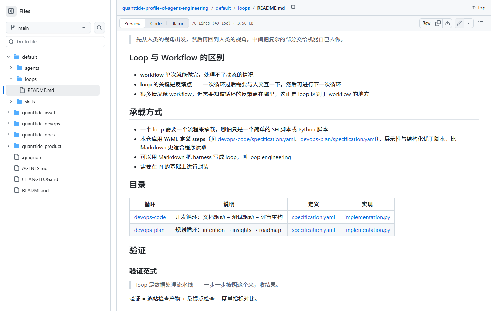
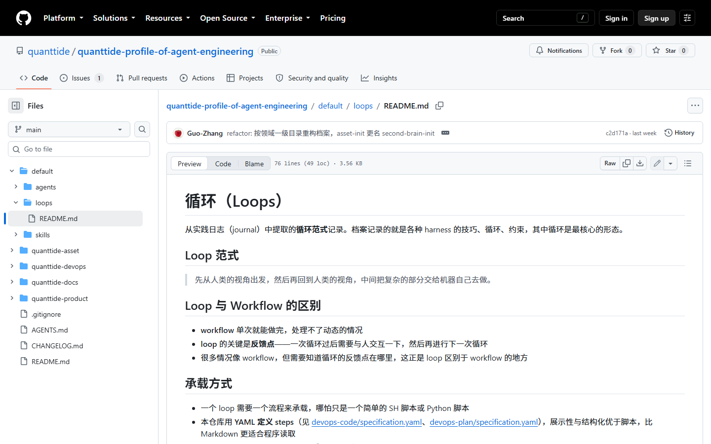
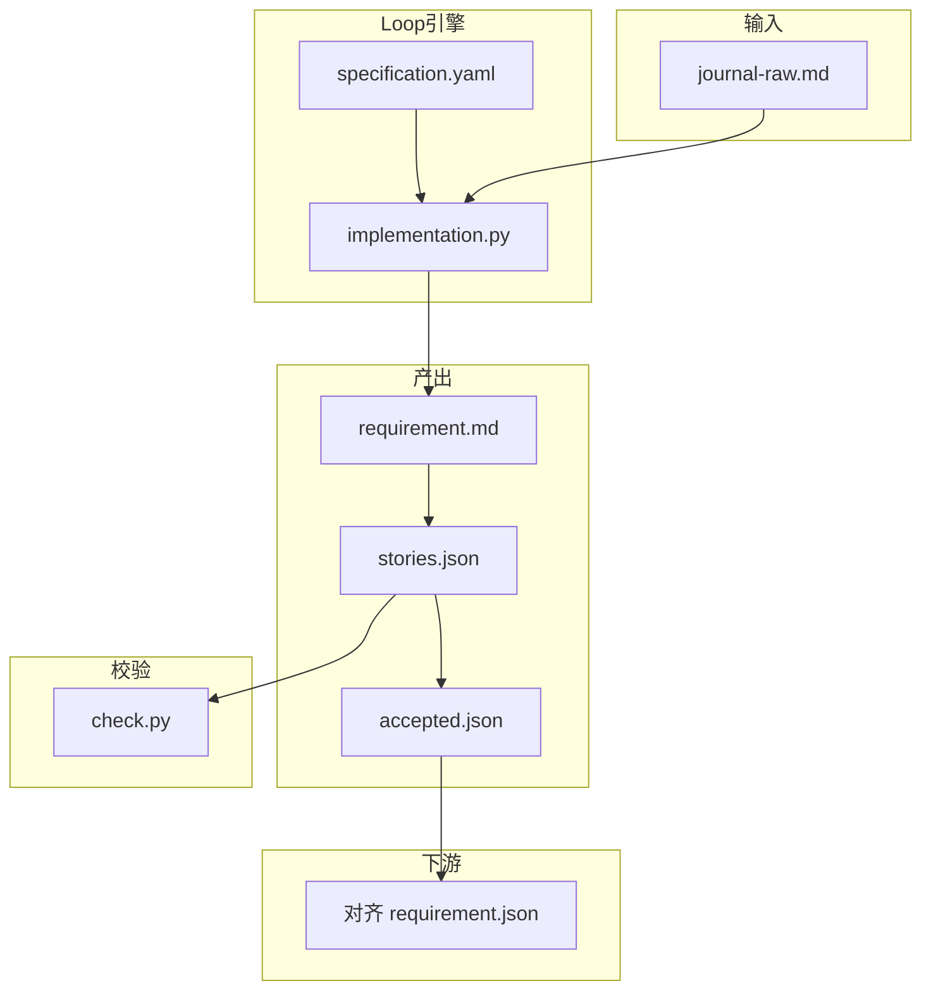
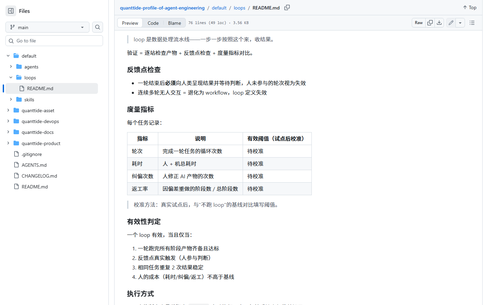

# 实训基地课题申请

**课题名称：** 产品需求梳理智能体（product-requirement Loop）  
**方向：** Agent 工程  
**申请人：** （填你的名字）  
**日期：** 2026-08-26  

> 配图说明：正文中的 **图1、图2…** 与下方截图一一对应。预览请用 `Ctrl+Shift+V`，并保证 `screenshots/` 与本文件同目录。

### 配图索引

| 编号 | 文件 | 内容 |
|------|------|------|
| 图1 | `13-product-cloud-capture.png` | 产品云：从研发日志捕捉用户故事 |
| 图2 | `03-product-requirement-index.png` | Agent 工程：product-requirement 仅有说明 |
| 图3 | `11-journal-asset.png` | 第二大脑：quanttide-journal 工作日志 |
| 图4 | `14-loops-from-journal.png` | Loop 从实践日志提炼 |
| 图5 | `12-requirement-json.png` | 产品云官方 requirement.json 结构 |
| 图6 | `02-loops-readme.png` | 已落地的两条 Loop 目录 |
| 图7 | `04-devops-code-spec.png` | devops-code 的 specification.yaml 模板 |
| 图8 | `08-implementation-py.png` | 官方 LangGraph 执行器 |
| 图9 | `09-loops-trials-section.png` | 官方验证指标与有效性判定 |
| 图10 | `10-product-cloud-stories.png` | 产品云：划分层级与人工调整 |

**配套文档：** [资料清单.md](./资料清单.md) · [项目实现流程报告.md](./项目实现流程报告.md) · 代码骨架 `project/`

---

## 引子：小王弄丢了一段需求

产研负责人小王开完周会，在飞书里留下几行零碎话：

```text
产品云那边说日志太散了，想从研发日志里抓用户故事。
先别做画布，能整理成「用户要…」就行。
AI 帮忙分活动、任务、故事，人改完再定稿。
别瞎编，原文没说的不要加。
```

一周后他要排期，却发现：**没人能说出这几句话最后变成了哪几条需求，更说不清有没有 AI 自己加的内容。**

量潮并不是没想清楚怎么做。产品云的需求文档里，已经把「从日志抓故事 → AI 分层 → 人改 → 评审」写成了正式流程——见 **图1**（官方仓库 `qtcloud-product/requirement.md`）：

**图1** 产品云官方需求：捕捉用户故事、划分层级、人工调整  
来源：https://github.com/quanttide/quanttide-profile-of-product-development/blob/main/qtcloud-product/requirement.md


但在 Agent 工程侧，本该承接这条链路的 `product-requirement` 循环，**只有一页流程说明，没有可执行实现**——见 **图2**：

**图2** Agent 工程：product-requirement 目录仅有 index.md，未进 loops 正式表  
来源：https://github.com/quanttide/quanttide-profile-of-agent-engineering/tree/main/default/loops/product-requirement


本课题要做的，就是沿着产品云已经画好的方向，在 Agent 工程里**把这条管线从「说明书」建成「能跑、能复用、能溯源」的系统**。下面第二节是完整设计过程；第三节是交付与计划。

---

## 一、设计目标

| 维度 | 目标 |
|------|------|
| 业务 | 帮产研负责人把零碎日志变成结构化用户故事，并能追到原文 |
| 工程 | 在 Agent 工程仓库补齐第三条 Loop，与 devops-code / devops-plan 同级 |
| 验证 | 用官方 trials 范式跑通一次试点，留下可对比的数据 |
| 边界 | 本期文件级对接产品云，不做 UI、不接飞书 API、不做 JSON→SQL |

---

## 二、课题设计

设计按「先打地基 → 定边界 → 搭主流程 → 补漏洞 → 接下游 → 验收」推进。故事里的「小王」会穿插在各阶段：每完成一层，都会暴露新问题，再用下一层补丁解决——这是真实的迭代路径，不是事后拼凑的问答。

### 2.1 地基：输入从哪来、输出长什么样、约束是什么

任何系统要先钉死三件事：**吃什么、吐什么、不能干什么。**

#### 输入：研发日志

产品云写的是：产研负责人**选择日志来源（产品流、时间段）**，把零碎话语交给 AI（图1）。

**导师指定官方日志仓库：**

| 仓库 | 用途 |
|------|------|
| [quanttide-journal-of-product-development](https://github.com/quanttide/quanttide-journal-of-product-development) | **主输入**：产品研发日志，如 `qtcloud-product/2026-08-19.md` |
| [quanttide-journal-of-cognitive-engineering](https://github.com/quanttide/quanttide-journal-of-cognitive-engineering) | **配套参考**：认知工程思路（「讲故事」垫全局观） |

在第二大脑体系里，日志也属于能力轴上的 **quanttide-journal** 资产（图3）。Loop 范式从实践日志提炼（图4），`devops-code` 标注来自 journal 2026-08-02。

**图3** 第二大脑 README：quanttide-journal 为工作日志资产  
来源：https://github.com/quanttide/quanttide/blob/main/README.md



**图4** loops README：循环范式从实践日志提取  
来源：https://github.com/quanttide/quanttide-profile-of-agent-engineering/blob/main/default/loops/README.md



**设计决策（输入层）：** 本期用官方产品研发日志的摘录作为试点输入，存放于 `project/trials/case-01/input/journal-raw.md`（来源见同目录 `SOURCE.md`）。CLI：`python implementation.py trials/case-01 …`。录用后可改为产品云「选来源」导出或 journal 仓库路径——**接口形态不变**。

> **故事：** 小王从 `qtcloud-product/2026-08-19.md` 复制一段日志进 case-01，设计上的输入层落地。

#### 输出：用户故事 JSON

产品云已经把「用户故事」定义成 **「用户要…」句式**，并组织在 **活动 → 任务 → 故事** 三层结构下。官方结构化版本见 `requirement.json`（图5）：

**图5** 产品云官方 requirement.json：活动 / 任务 / 故事 三层  
来源：https://github.com/quanttide/quanttide-profile-of-product-development/blob/main/qtcloud-product/requirement.json


本课题的输出 `stories.json` **字段对齐图5 的层级语义**，并额外增加 `source_quote`、`reason`、`coverage`，用于溯源与完整性检查（后文 2.4 节展开）。

#### 约束：product-requirement 循环与产品云分工

图2 的 index.md 定义了三步：乱话→Markdown→JSON→SQL，并强调 **转 JSON 时禁止编造**。图10 补充了产品云侧「划分层级、人工调整、查看依据」的细节：

**图10** 产品云：划分层级、人工调整、需求评审  
来源：同图1 文档


**设计决策（范围层）：** 本期实现 **前两步（Markdown + JSON）**；第三步 SQL 写入 yaml 标为 `deferred`。人机分工遵循图1、图10：**AI 提取与初分，人评审定稿**——不是全自动抓取，也不是纯人工抄写。

---

### 2.2 承重结构：Loop 标准与执行引擎

地基钉好后，要决定「用什么骨架盖楼」。量潮 Agent 工程里，这个骨架叫 **Loop**，已有成熟先例。

#### 先例：两条已落地的 Loop

图6 显示，官方 loops 目录目前只登记了 `devops-code` 与 `devops-plan`，均有 yaml + 实现：

**图6** loops 目录：devops-code / devops-plan 已落地  
来源：同图4 文档



#### 模板：specification.yaml 怎么写

新 Loop 的字段 **照 devops-code 的 yaml 抄**，只改步骤内容。模板见 **图7**：

**图7** devops-code specification.yaml（entry / exit / steps / feedback / loop / metrics）  
来源：https://github.com/quanttide/quanttide-profile-of-agent-engineering/blob/main/default/loops/devops-code/specification.yaml


#### 引擎：谁来跑这套 yaml

官方已提供基于 **LangGraph** 的 `implementation.py`：步骤串联，到反馈点用 `interrupt` 暂停等人输入（图8）。本课题 **不重写引擎**，只为 product-requirement 新写一份 yaml，让同一执行器能跑。

**图8** 官方 implementation.py：LangGraph + interrupt 等人  
来源：https://github.com/quanttide/quanttide-profile-of-agent-engineering/blob/main/default/loops/devops-code/implementation.py


**设计决策（架构层）：** product-requirement = 新 yaml + 复用 implementation.py + 新增 check.py（校验脚本，见 2.4）。整体关系如下：



---

### 2.3 主流程：三层递进，故事驱动

主楼分三层盖，每层对应 Loop 里的步骤；小王在每层都会遇到典型问题，设计用下一层或补丁解决。

#### 第一层：先把乱日志讲成「一件事」（垫全局观）

研发方法强调产品**全局观**，这是 AI 的弱项（导师意见）。因此 Step1 不叫「整理 Markdown」，而叫 **「整理需求故事」**：先用 2～4 句话讲清「到底要干什么」，再拆背景/要做什么/不做/待确认/原文摘录。

- **步骤：** Step1 → 产出 `output/requirement-story.md`  
- **提示词：** 见 `project/trials/case-01/prompts/step1-story.md`  

> **故事：** 小王第一次跑，AI 把四条需求揉成列表，读不出主线。  
> **补丁：** Step1 强制先写「全局故事」段落，再结构化——用讲故事垫一层，再抽用户故事。

#### 第二层：在反馈点让人改，而不是一次定稿

- **机制：** 官方 Loop 要求 **反馈点**——一轮结束后必须等人判断，否则退化为 workflow（图6 范式说明）。  
- **实现：** `interrupt` 挂起，人输入 `ok` 或 `revise: …`（图8）。  
- **步骤：** Step1 后、Step2 后各设反馈点。  

> **故事：** 小王发现 AI 没把「用户要…」格式写清楚。他在终端输入 `revise: 故事必须用用户要开头`，Loop 带意见重跑 Step1。  
> **补丁：** 反馈点不是装饰，是产品云「人工调整」在 CLI 里的最小实现（对应图10）。

#### 第三层：抽出用户故事 JSON，并接上校验

- **步骤：** Step2「提取用户故事 JSON」→ `output/stories.json`  
- **字段：** `level`（activity|task|story）、`text`（用户要…）、`source_quote`、`reason`、`confidence`  
- **步骤：** Step3「人工评审定稿」→ `output/accepted.json`  

主流程时序：

```mermaid
sequenceDiagram
  participant 小王
  participant Loop as product-requirement Loop
  participant Check as check.py

  小王->>Loop: 提供 journal-raw.md
  Loop->>Loop: Step1 生成 requirement.md
  Loop->>小王: 反馈点：请确认或 revise
  小王->>Loop: revise 意见
  Loop->>Loop: Step2 生成 stories.json
  Loop->>Check: 自动校验编造/覆盖率
  Check-->>小王: 报告
  小王->>Loop: ok 定稿 accepted.json
```

> **故事：** 小王担心 AI 把「别做画布」理解成一条新功能。  
> **补丁：** 交付 `check.py`，自动检查：`source_quote` 必须是原文子串；原文分句覆盖率不足则写入 `uncovered.md` 提醒补抓。人仍在反馈点做最终确认，脚本是辅助。

**specification.yaml 草案（本期）：**

```yaml
name: product-requirement
description: 研发日志 → 需求说明 → 用户故事 JSON（SQL 阶段 deferred）
entry: 人类提供原始日志文件路径
exit: 人类确认 accepted.json 定稿

steps:
  - name: 整理需求说明
    actor: ai
    artifact: output/requirement.md
    check: 含原文摘录；不新增原文没有的需求点

  - name: 提取用户故事 JSON
    actor: ai
    artifact: output/stories.json
    check: 每条含 level、text、source_quote、reason

  - name: 人工评审定稿
    actor: human
    artifact: output/accepted.json
    check: 人确认或 revise 后重跑

feedback:
  - after: 整理需求说明
    actor: human
    ask: 格式与内容是否可进入 JSON 提取？
  - after: 提取用户故事 JSON
    actor: human
    ask: 有无多余、遗漏或分层错误？

loop:
  condition: revise → 回到对应 step
  exit: 人类确认 accepted.json

metrics: [rounds, time, corrections, rework]
```

---

### 2.4 补丁层：溯源、复用、对接、验收

主流程跑通后，还要解决「能不能信、能不能再用、能不能接产品云、怎么证明有效」——这是从主楼到可交付大厦的最后几层。

#### 溯源：每条故事能回到原文

| 设计要素 | 作用 | 与官方对齐 |
|----------|------|------------|
| `source_quote` | 指向日志原句 | 图10：「查看 AI 划分的依据（来源日志）」 |
| `reason` | 说明分层理由 | 图10：「判断理由，便于复核」 |
| `coverage` | 统计原文句覆盖率 | 本期补充，防「漏抓」 |
| 分轮留档 | `output/round-N/` 不覆盖 | 图9：产物齐备 |

#### 复用：换日志不换流程

- `specification.yaml` 定义步骤，换一段 `journal-raw.md` 仍用同一命令。  
- 执行器复用 `implementation.py`，不维护第二套运行时。  
- 每个试点独立目录 `trials/case-XX/`，便于对比与审计。

#### 对接产品云：本期文件级，下期 API

产品云与 Agent 工程是上下游：第二大脑要求 **应用数据回流档案**。本期不做画布和 API，但输出 **对齐图5 的 `requirement.json` 三层语义**，产品云将来可直接 ingest 该文件。

输出示例：

```json
{
  "meta": { "source_file": "input/journal-raw.md", "loop": "product-requirement", "round": 2 },
  "stories": [
    {
      "level": "task",
      "text": "用户要把零碎话语整理成「用户要…」格式的故事卡片",
      "source_quote": "能整理成「用户要…」就行",
      "reason": "对应图1「捕捉用户故事」任务",
      "confidence": 0.88
    }
  ],
  "coverage": { "total_sentences": 4, "covered_sentences": 4, "uncovered": [] }
}
```

| 对接项 | 本期 | 录用后扩展 |
|--------|------|------------|
| 输入 | 本地 md 文件 | 产品云选日志来源后导出 |
| 输出 | `accepted.json` | 故事地图后端 API |
| Schema | 对齐 requirement.json | 跟内部契约统一 |

#### 验收：check.py + trials 试点

**验收门槛（课题申请声明，试点必须全部满足——不是实验预测值）：**

| 门槛 | 数值标准 |
|------|----------|
| 编造条数 `fabrication_count` | **= 0** |
| `source_quote` 通过率 | **= 100%** |
| 句覆盖率 `sentence_coverage_rate` | **= 100%** |
| 未覆盖句 | 写入 `uncovered.md`，且 `review.comments` 含人工确认说明 |
| 反馈点 | 至少触发 **1 次** |
| `accepted.json` | 每条 `approved: true`，`revisions` 非空 |

`check.py` 自动检查（见 `project/check.py`）：

```bash
python check.py output/stories.json --source input/journal-raw.md
python check.py output/accepted.json --source input/journal-raw.md --strict
```

试点 **实测数据**（编造几条、纠偏几次等）只写在 `trial-report.md`，不写在申请里。对照官方 **图9** 记录 metrics。

**图9** 官方验证：metrics 四项与有效性判定  
来源：同图4 文档「验证」一节



> **故事收尾：** 小王跑完 case-01，`check.py` 全绿，`accepted.json` 里每条故事带 `approved` 和 `revisions`——人工确认可在交付物里客观核验。实测对比填 `trial-report.md`。

---

## 三、交付清单

| # | 交付物 | 验收 |
|---|--------|------|
| 1 | `project/product-requirement/specification.yaml` | 字段对齐图7；含 acceptance 数值门槛 |
| 2 | 可运行 Loop（复用图8 执行器） | case-01 全流程 + 至少 1 次反馈点 |
| 3 | `project/check.py` | 编造=0、覆盖率=100%、strict 模式通过 |
| 4 | `project/trials/case-01/` | input、output、accepted.json（含 approved/revisions）、trial-report |
| 5 | `project/README.md` + [项目实现流程报告.md](./项目实现流程报告.md) | 他人可按报告逐步复现 |

**不做：** 产品云 UI、飞书 API、JSON→SQL。

**开工请直接阅读：** [项目实现流程报告.md](./项目实现流程报告.md)（阶段 0～7，每步有验收标准）。

---

## 四、计划与支持

| 时间 | 内容 |
|------|------|
| 08-26 前 | 提交申请 |
| 08-27～08-31 | yaml、check.py、dry-run |
| 09-01～09-07 | 接 LLM，跑通 case-01 |
| 09-08～09-16 | trial-report，答辩 |

**希望支持：** fork 公开仓库实验；确认 stories.json 与产品云内部 schema 差异；可选提供脱敏 journal 样例。

---

## 五、结语

本课题不是把周会记录美化成 Markdown，而是在 Agent 工程里 **补齐 product-requirement 这条 Loop**：从 journal 类输入出发，经官方 LangGraph 引擎与反馈点，产出可溯源、可复用、可对接产品云的用户故事 JSON，并用 trials 证明这条管线值得写进 loops 正式目录。

**设计主线回顾：** 定输入输出边界（2.1）→ 选用官方 Loop 骨架（2.2）→ 三层主流程 + 故事驱动补丁（2.3）→ 溯源、复用、对接、验收（2.4）→ 交付与试点（第三节）。
