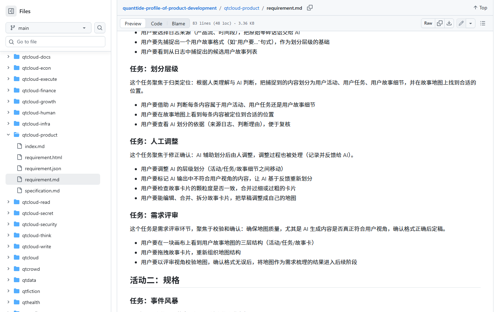
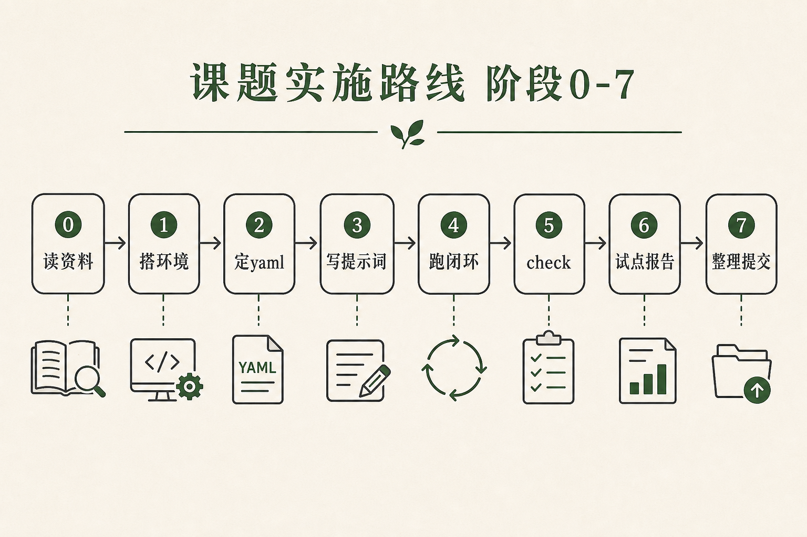
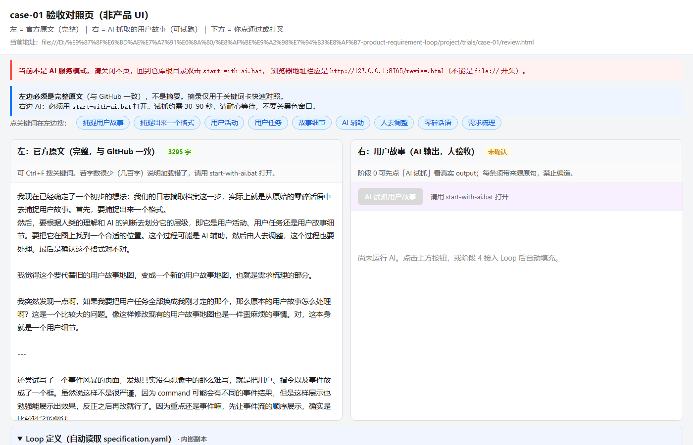
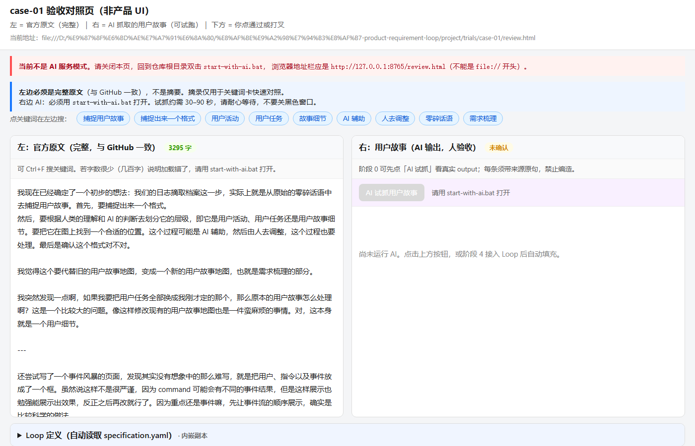
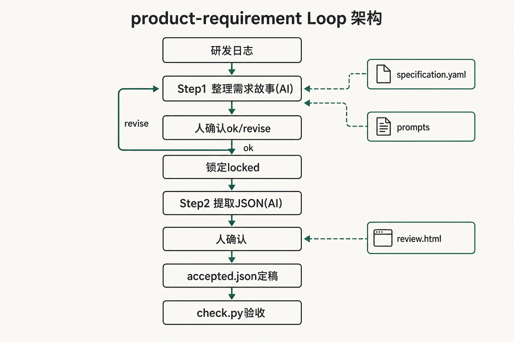
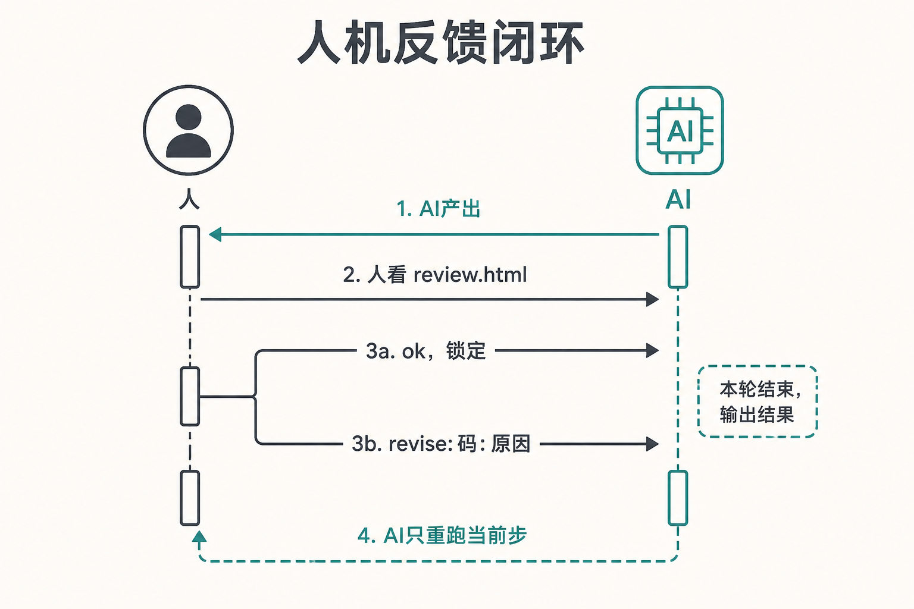
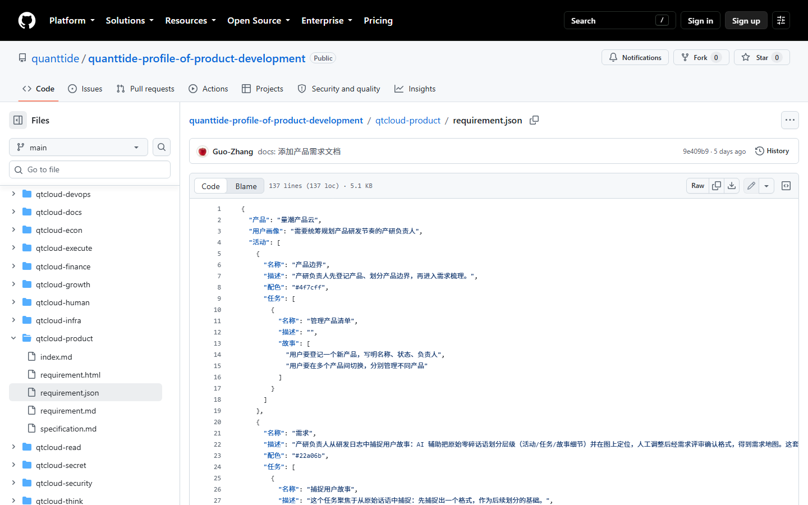
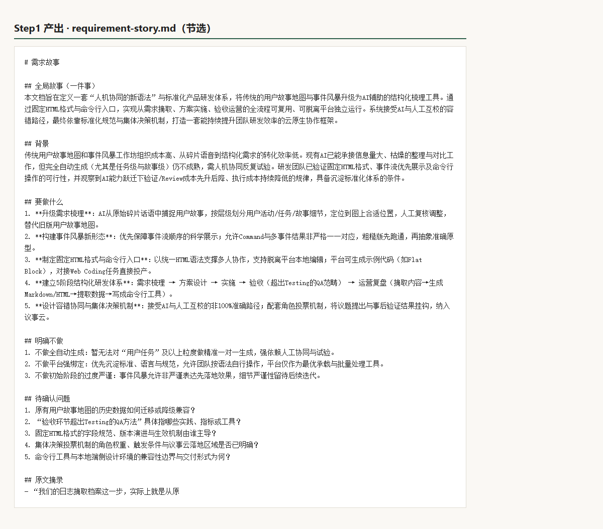
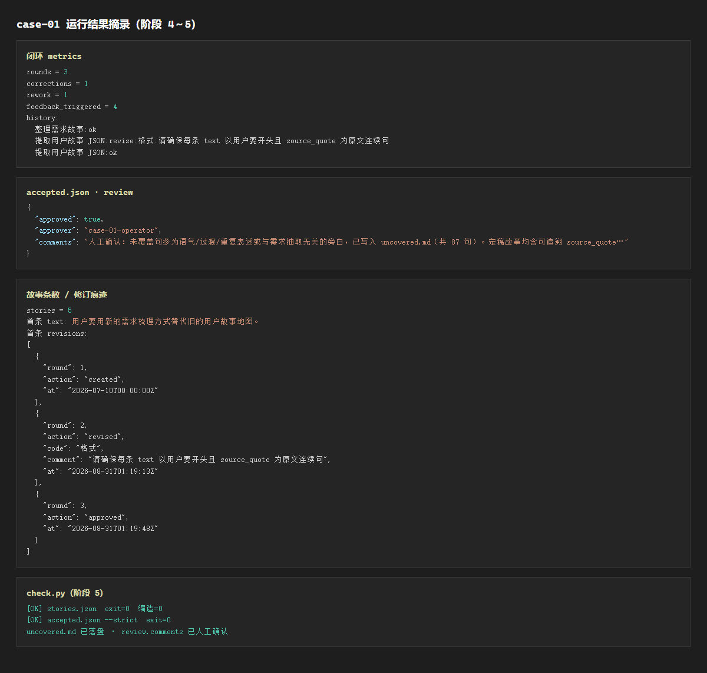

# 小王弄丢需求之后：我的阶段 0～7 答辩故事

> **推荐打开方式（企业级 Web 版）：**  
> 双击仓库根目录 **`open-defense-report.bat`**，或浏览器打开 [`index.html`](./index.html)  
> **和验收页一起：** 运行 `start-with-ai.bat` 后访问 `http://127.0.0.1:8765/report/`  
> **VS Code 看图：** 打开本 `.md` → `Ctrl+Shift+V` 预览  
> **拍视频：** 看 [`拍视频操作说明.md`](./拍视频操作说明.md)

---

## 一、故事从哪儿开始

小王开完会，在飞书里丢了几句话：

> 日志太散了，想从里面抓「用户要……」  
> AI 帮忙分一分，人改完再定稿。  
> **别瞎编，原文没说的不要加。**

他觉得说清楚了。  
可一周后排期，没人能回答三个问题：

1. 这几句话最后变成了哪几条需求？  
2. AI 有没有自己加戏？  
3. 谁拍板说「这条算数」？

**这就是我要做的课题：** 不是再做一个聊天机器人，而是把「从日志到定稿」这条线，做成**能跑、能改、能留痕、能给别人复现**的一套东西。

---

## 二、官方其实早就画过饼，但还没盖厨房

我去读了产品云的需求文档。那边写得很明白：要从研发日志里抓用户故事，人要能改，层级要分得清。



*图 1 · 产品云官方需求（我们是对着它干的）*

但在 Agent 工程那边，同名的东西**只有一页说明**，没有能真正跑起来的程序。


*图 2 · 官方仓库里 product-requirement 当时的状态*

所以我给自己定了个大白话目标：

**把说明书，变成能用的流水线。**

---

## 三、八个阶段，其实是盖一栋楼

我没有一上来就调 AI。我是按盖楼顺序来的——先搞懂要盖啥，再搭脚手架，再画承重墙，再写台词，再真盖，再验收，再写实测，最后打扫干净让别人也能进来。



*图 3 · 阶段 0→7 总路线*

| 阶段 | 我用人话怎么说 | 做完手里有什么 |
|------|----------------|----------------|
| **0** | 先把官方资料读透，学会「怎么验 AI 写的对不对」 | 验收对照页、阅读笔记 |
| **1** | 把电脑环境装好，AI 能连上 | 虚拟环境、启动脚本 |
| **2** | 画流水线图纸：几步、谁做、产物放哪 | 流水线定义文件 |
| **3** | 写 AI 每步该怎么说 | 两步提示词 |
| **4** | **真跑一遍**：人点头或打叉，通过的锁起来 | 定稿 + 锁定文件夹 |
| **5** | 用程序自动查：有没有编造、格式对不对 | 检查脚本全绿 |
| **6** | 写试点报告：门槛是门槛，实测是实测 | trial-report |
| **7** | 整理文档，别人按 README 也能跑 | 总说明、一键脚本 |

下面按时间线讲我每一阶段**具体干了啥、为啥这么干**。

---

## 四、阶段 0：先学会「怎么验」，再谈自动化

### 我遇到了什么

如果 AI 抽出来的故事和原文对不上，或者自己编了一条，人看不出来，后面全白搭。

### 我做了什么

我做了一个**验收对照页**（你可以理解成「阅卷纸」）：

- **左边**：完整官方日志，一字不改  
- **右边**：AI 试抓的用户故事  
- **下面**：✓ 通过，或 ✗ 打叉（打叉必须写原因）



*图 4 · 左原文、右故事、下确认——答辩时可以 live 演示*

页面上还能展开「流水线定义」，和图纸文件内容一致，方便对照。



*图 5 · 自动读出流水线图纸，不用手翻 yaml*

### 打叉怎么说人话

我定了五种原因，和老师、和后面真跑流水线时是一套：

| 你点 | 意思 |
|------|------|
| 编造 | AI 加了原文没有的东西 |
| 分层 | 活动/任务/故事分错了 |
| 漏了 | 原文有，AI 没抓到 |
| 格式 | 不像「用户要……」这种句式 |
| 其他 | 以上都不像，但总觉得不对 |

**阶段 0 的结论：** 先让人会用眼睛验，后面机器跑才有标准。

---

## 五、阶段 1：把「桌子」摆好

这一步不 glamorous，但缺了不行：

- 装了 Python 环境和依赖  
- AI 默认用 Agnes（免费），以后换商业模型只改配置  
- 官方的执行器能「预演」三步：整理故事 → 抽 JSON → 人定稿  

**阶段 1 的结论：** 工具齐了，但还没真盖楼。

---

## 六、阶段 2：画承重墙——流水线图纸定稿

我把「这条线怎么跑」写进一份**图纸文件**（老师那边叫 specification.yaml）：

```
第 1 步  AI  把乱日志整理成「一件事」  →  需求故事.md
         ↓ 人停一下：通不通？能往下走吗？
第 2 步  AI  从故事里抽出 JSON 条目   →  stories.json
         ↓ 人再停：有没有编造？分层对不对？
第 3 步  人  定稿                     →  accepted.json
```

还写清楚了两条规矩（后面阶段 4 要在程序里真执行）：

1. **你点通过，就锁住**——第一步通过后复制到 `locked/`，后面改第二步时不乱动第一步。  
2. **你点打叉，只重跑当前这一步**——不用从头再来。



*图 6 · 从日志到定稿，中间两次「人停下来」*



*图 7 · 人不是摆设：ok 锁、revise 只改当前步*

对照官方成熟的 devops-code 图纸，字段结构一致，答辩时好讲「我们是同一套范式」。


*图 8 · 不是从零发明，是对齐官方模板*

故事 JSON 长什么样，也对齐产品云的结构：



*图 9 · 每条故事要有层级、原文出处*

**阶段 2 的结论：** 图纸画死了，三步、两次停顿、锁定规则，都写清楚。

---

## 七、阶段 3：给 AI 写「台词本」

图纸有了，还要告诉 AI **每一步具体怎么说**。

我拆成两个提示词文件：

| 文件 | AI 在干什么 | 打个比方 |
|------|-------------|----------|
| **第一步台词** | 先把日志讲成「一件事」，再拆背景/要做/不做/摘录 | 像给领导写一页 briefing |
| **第二步台词** | 从 briefing 里抽「用户要……」条目，每条必须带原文出处 | 像从 briefing 里摘待办清单 |

**关键规矩写死在台词里：**

- 不许编造——原文没有的，写进「待确认」，不能写成已定需求  
- 每条必须以「用户要」开头  
- `source_quote` 必须是原文里**一字不差**的连续句子  

第一步跑出来的故事长这样（节选）：



*图 10 · Step1 产物：先讲成一件事，再结构化*

验收页上的「AI 试抓」和正式第二步，**读同一份台词**，避免两套规则打架。

**阶段 3 的结论：** 台词定稿，并试跑出了草稿故事和 JSON。

---

## 八、阶段 4：真盖楼——跑通一整圈

这是整个课题的**高潮**：不是手动复制粘贴，而是程序按图纸跑，**人在两个关口真正停下来**。

我跑 demo 时的反馈序列是这样的：

1. 第一步做完 → 我输入 **ok** → 第一步被**锁进** `output/locked/`  
2. 第二步做完 → 我故意输入 **revise:格式:……** → 只重跑第二步  
3. 改完再 **ok** → 生成 **定稿文件** `accepted.json`



*图 11 · 跑了 3 轮、纠偏 1 次、有完整 history 记录*

定稿里每条故事都有**修订履历**（什么时候创建、什么时候被打回、什么时候批准）——这就是「可追溯」，不是口头说「我验过了」。

**阶段 4 的结论：** 流水线真转了，锁定真发生了，定稿真写出来了。

---

## 九、阶段 5：机器当质检员

人眼验一遍不够，我还写了自动检查程序 `check.py`：

| 查什么 | 标准 |
|--------|------|
| 有没有编造 | 每条「原文出处」必须能在日志里搜到 |
| 句式对不对 | 必须以「用户要」开头 |
| 定稿合不合格 | 每条 approved、修订履历不能为空 |

口语日志不可能句句都变成用户故事。我的做法是：

- 没覆盖到的句子 → 写到 `uncovered.md`  
- 在定稿的 `review.comments` 里**用一句话说明**：为什么可以接受  

这样「100% 覆盖」在课题语义上是：**该抽的都有出处，剩下的有说明**，而不是硬凑 90 句故事。

**阶段 5 的结论：** 两条检查命令都退出码 0，机器验收通过。

---

## 十、阶段 6：写试点报告——别把「门槛」和「实测」混一起

课题申请里写的是**门槛**（比如编造必须 0）。  
我实际跑出来的 rounds、耗时、覆盖率，写在 **trial-report.md** 里，单独一栏「本次实测」。

这样答辩时老师问「你跑了几轮、纠偏几次」，我指报告；问「标准是什么」，我指申请和图纸。

**阶段 6 的结论：** 有 Loop 时，打叉有通道、只重跑当前步；一次性让 AI 吐 JSON，出了问题不好定位。

---

## 十一、阶段 7：打扫现场，让别人也能跑

最后我把 scattered 的东西收拢：

- 根目录 README：现在进行到哪一步  
- `run-stage4-loop.bat`：一键 demo 闭环  
- `verify_all.py`：阶段 0～7 串联自检  
- 本文件夹：**给老师看的总报告 + 全部配图**

**阶段 7 的结论：** 换一个人，按文档也能复现 case-01。

---

## 十二、给老师看的「三份硬证据」

录视频或答辩时，镜头请停在这三处 5 秒：

| # | 打开什么 | 证明什么 |
|---|----------|----------|
| 1 | `project/trials/case-01/output/accepted.json` | 有 `revised` 和 `approved`，不是一次过 |
| 2 | `project/trials/case-01/output/locked/step1-requirement-story.md` | 通过后真的锁了 |
| 3 | 终端跑 `python scripts\verify_all.py` 全绿 | 八个阶段自检都过 |

---

## 十三、我的一句话总结（答辩结尾可念）

官方产品云早就说要从日志抓用户故事，但 Agent 工程侧长期只有说明书。  
我用八个阶段，把它做成了**能跑、能改、能锁、能验、能留痕**的一条线。  
不是「聊天抽 JSON」，而是**人两次把关、机器两次产出、最后定稿带修订记录**。

SQL 那一步本期不做，写在图纸的「以后再说」里。

---

## 附录：本文件夹里有什么

| 文件 | 干什么用 |
|------|----------|
| **`index.html`** | **主入口** — 企业级 Web 答辩报告（侧边栏、统计、图片放大） |
| **本文件 `.md`** | VS Code 预览看图 + 读故事 |
| `阶段0-7全景答辩报告.html` | 自动跳转到 index.html |
| `拍视频操作说明.md` | 分镜、口播、怎么拍 |
| `assets/*.png` | 全部配图（**不要和 html 分开拷贝**） |

更细的分阶段技术报告仍在：`docs/阶段0/` … `docs/阶段7/`（给想翻细节的人）。
