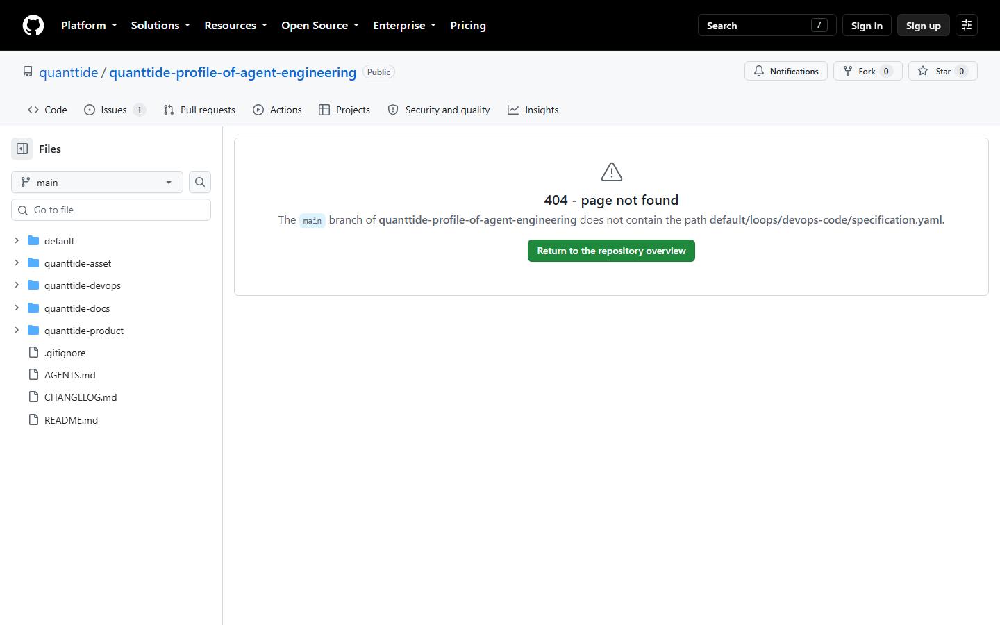
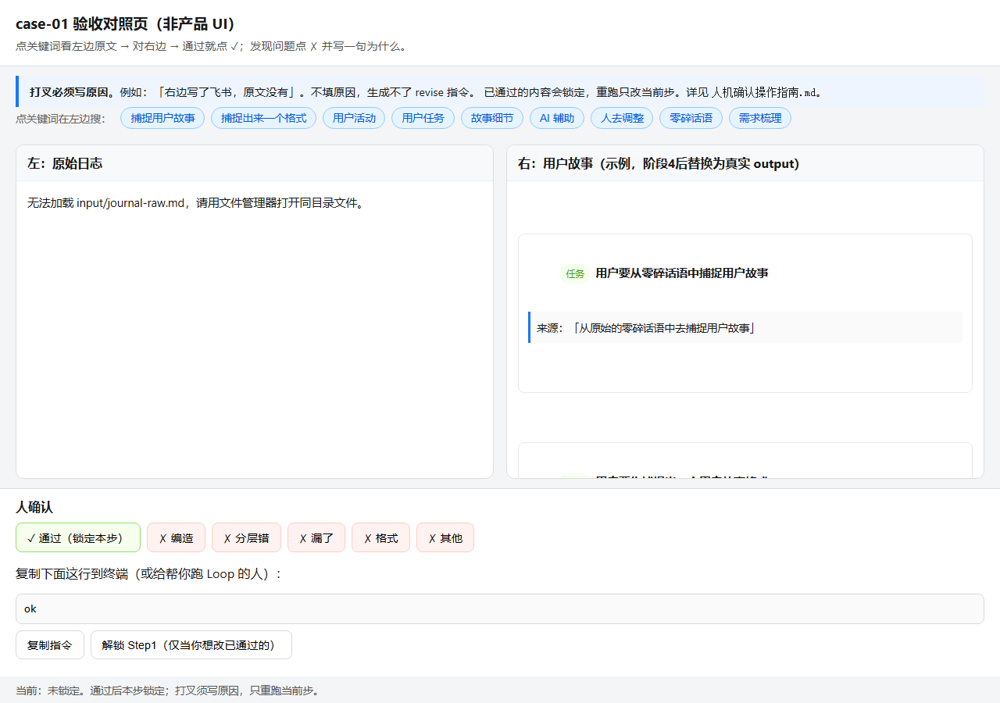
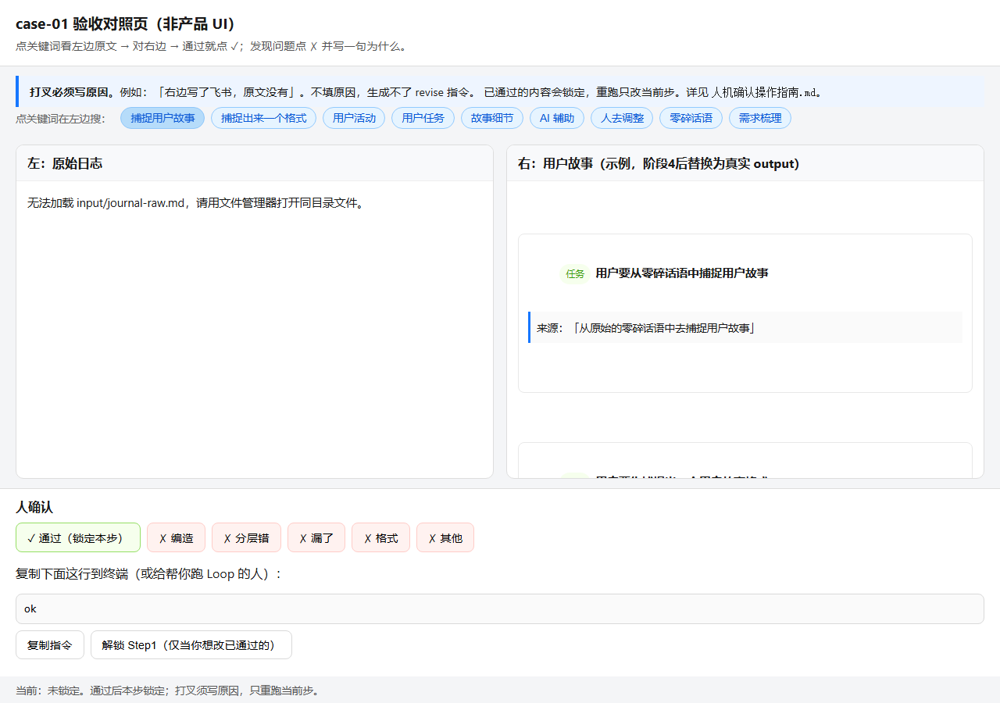
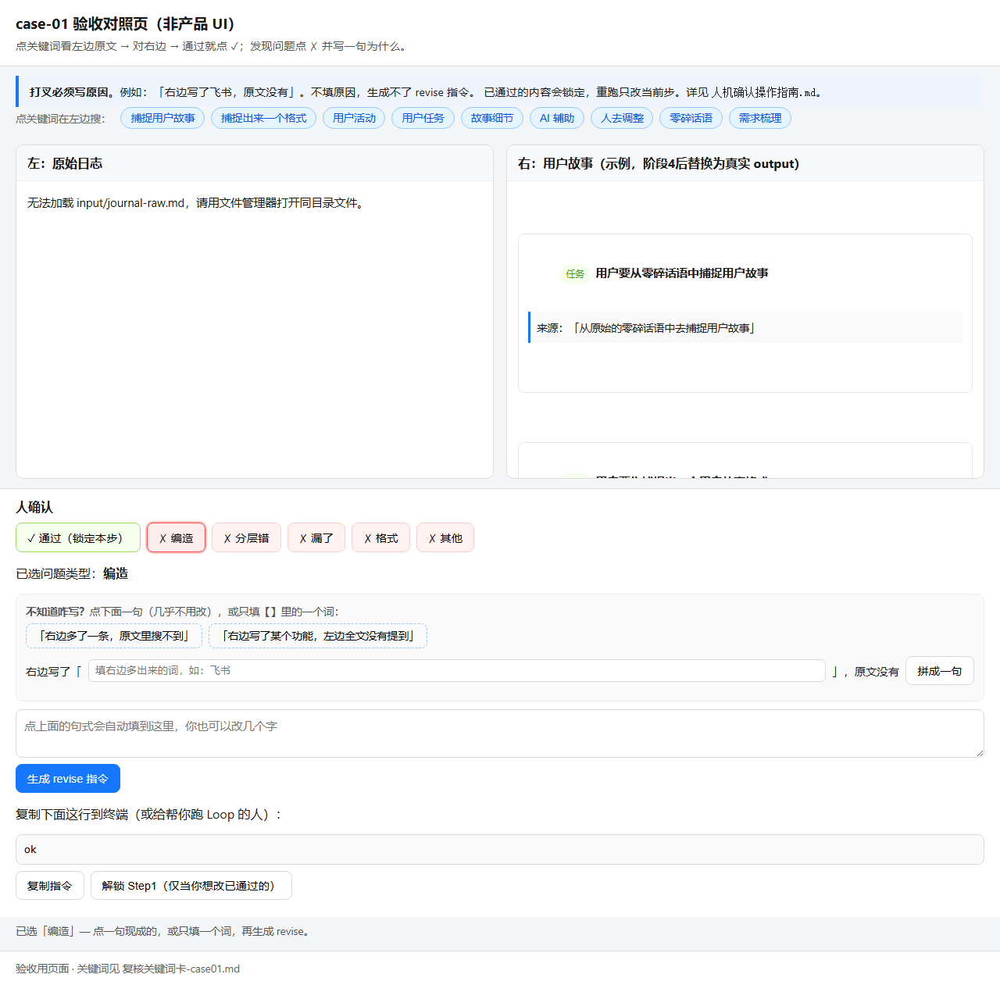
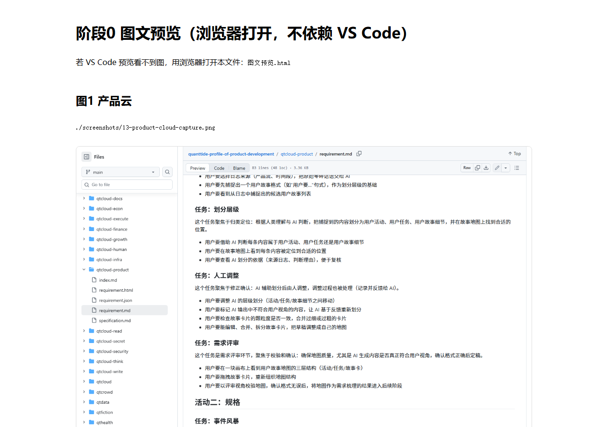
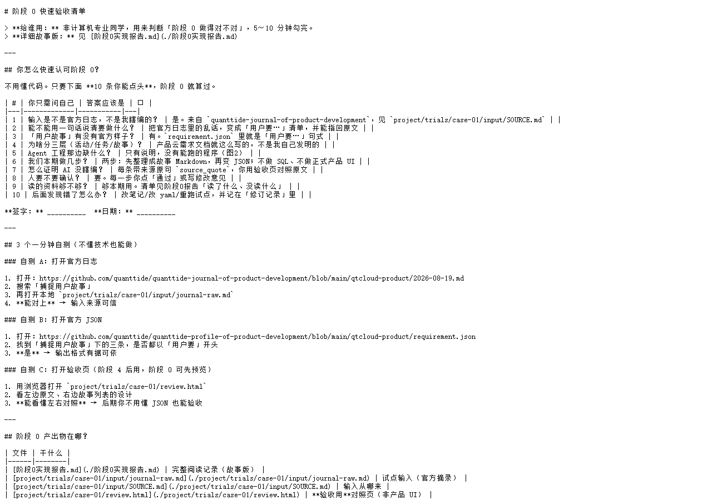

# 阶段 0 验收操作手册（详细版）

> **怎么用这份手册：** 先双击项目里的 **`启动阶段0验收.bat`**，浏览器会自动打开验收页。然后**从下面「第 0 步」开始**，做完一步勾一步。  
> **要花多久：** 第一次大约 40 分钟，熟练后 20 分钟。  
> **你需要：** 电脑、浏览器（Chrome 或 Edge）、能上网（对照 GitHub 官方页面）。

---

## 写在最前：阶段 0 是在验什么？

想象你要装修房子。阶段 0 不是刷墙，而是：

1. **输入有没有依据** —— 以后 AI 读的日志，是不是官方真日志，不是你编的  
2. **目标清不清楚** —— 最后要产出啥样儿的「用户故事」，官方有没有规定  
3. **你以后能不能验收 AI** —— 有个对照页，左边原文、右边故事，你能打勾打叉  

**阶段 0 不用写代码、不用 API Key。** 你是在确认：**资料读懂了，工具能上手，敢进阶段 1。**

全部做完后，在 [阶段0快速验收清单.md](./阶段0快速验收清单.md) 签字，阶段 0 结束。

---

## 第 0 步：启动项目（必做，约 2 分钟）

> **重要：** 请优先双击 **`open-review.bat`**（纯英文文件名，不会乱码）。  
> `启动阶段0验收.bat` 只是转调它的高级版；**验收页能不能打开，看的是 `open-review.bat`。**

### 0.1 找到项目文件夹

路径示例（以你电脑为准）：

```
D:\量潮科技\课题申请-product-requirement-loop
```

在文件夹里应能看到：

| 文件 | 干什么 |
|------|--------|
| **`open-review.bat`** | **先双击这个** — 只打开验收对照页，最稳 |
| `start-stage0.bat` | 打开验收页 + 预览 + 手册 + 自动检查 |
| `启动阶段0验收.bat` | 同上（中文名入口，内部转调英文脚本） |

**□ 我看到了 `open-review.bat`**

---

### 0.2 双击打开验收页（核心步骤）

1. **双击 `open-review.bat`**（推荐，不要先点中文名的 bat）  
2. 会弹出一个**黑色命令行窗口**，里面是**英文**，不应出现乱码  
3. 几秒内，**浏览器会自动打开**一个新标签页  
4. 窗口最后写：`Press any key to continue...`（按任意键继续）

#### 关于「按任意键窗口就没了」——这是正常的

- **关的是黑色命令行窗口**，不是浏览器  
- 浏览器标签页**应该还在**，请切到 Chrome / Edge 看一眼  
- 若你没看到浏览器：可能被挡在后面了，看任务栏有没有新标签  

**□ 浏览器里打开了「case-01 验收对照页」**

---

### 0.3 第一眼检查（验收页有没有用）

看浏览器页面：

| 位置 | 正常 | 不正常 |
|------|------|--------|
| **左边** | 有中文日志，开头像「我现在已经确定了一个初步的想法…」 | 「加载中」或空白 |
| **右边** | 有 3 条带绿色/橙色标签的故事 | 完全空白 |
| **顶部** | 蓝色按钮：「捕捉用户故事」等 | 没有按钮 |

**左边有字、右边有卡片 → 这一步就有用，继续第 1 步。**

**若浏览器没打开：** 黑色窗口里有一行以 `D:\...\review.html` 结尾的路径，**复制到浏览器地址栏**回车。

**□ 左边有日志，右边有故事**

---

### 0.4 可选：完整启动（不是必须）

验收页已经打开后，若想顺便打开图文预览和跑自动检查，再双击：

- `start-stage0.bat` 或 `启动阶段0验收.bat`

若出现**乱码**或**闪退**，**忽略它**，你已经有验收页了，不影响阶段 0 验收。

**□ 第 0 步完成（以验收页能打开为准）**

---

## 第 1 步：输入是不是官方的？（约 5 分钟）

**你在验什么：** 以后给 AI 的原材料，是不是从量潮官方日志抄的，不是瞎写的。

### 1.1 打开官方原文（需要联网）

1. 打开浏览器**新标签页**  
2. 地址栏粘贴下面链接，回车：  

```
https://github.com/hongwei-2026/quanttide-journal-of-product-development/blob/main/qtcloud-product/2026-08-19.md
```

（这是你 Fork 的仓库；和官方 `quanttide/...` 内容一致。）

3. 页面加载出来后，按键盘 **`Ctrl + F`**  
4. 在搜索框输入：**捕捉用户故事**，回车  
5. 页面上应**高亮**出现这几个字，附近还有「零碎话语」之类的话  

**□ 在 GitHub 网页上能搜到「捕捉用户故事」**

---

### 1.2 打开本地摘录，对一遍

1. 打开 **文件资源管理器**  
2. 依次进入：  
   `课题申请-product-requirement-loop` → `project` → `trials` → `case-01` → `input`  
3. **双击** `journal-raw.md`（会用记事本或 VS Code 打开）  
4. 同样 **`Ctrl + F`**，搜：**捕捉用户故事**  
5. 应能找到**和 GitHub 上意思相同**的一句话（本地是摘录，可以比网页短，但核心句必须在）  

**□ 本地 journal-raw.md 里也能搜到「捕捉用户故事」**

---

### 1.3 看「来源证明」文件

1. 在同一 `input` 文件夹里，打开 **`SOURCE.md`**  
2. 确认里面写了：  
   - 仓库名含 `quanttide-journal-of-product-development`  
   - 原始文件 `qtcloud-product/2026-08-19.md`  
   - 有一个能点开的 GitHub 链接  

**这一步确定了啥：** 答辩时能说「输入从官方日志来，有 SOURCE 留痕」。

**□ 第 1 步通过**

---

## 第 2 步：产品云到底要什么输出？（约 8 分钟）

**你在验什么：** 最后做出来的「用户故事」长什么样，官方有没有样板。

### 2.1 看需求文档（人话版）

1. 新标签打开（或看本仓库截图 `screenshots/13-product-cloud-capture.png`）：  
   https://github.com/hongwei-2026/quanttide-profile-of-product-development/blob/main/qtcloud-product/requirement.md  
2. 找到 **「捕捉用户故事」** 相关的小节  
3. 读完后，用**你自己的嘴**说一遍（不用背原文）：

> 把研发日志里的乱话，整理成「用户要……」的清单；分活动、任务、故事三层；每条能指回日志原句；人要能改。

说不出来时，再看一眼截图：


**□ 我能用一句话说清产品云要啥**

---

### 2.2 看 JSON 样板

1. 新标签打开：  
   https://github.com/hongwei-2026/quanttide-profile-of-product-development/blob/main/qtcloud-product/requirement.json  
2. 按 **`Ctrl + F`** 搜：**用户要**  
3. 应能看到多条，都以 **「用户要」** 开头，例如「用户要从零碎话语中捕捉用户故事」  


**□ 官方 JSON 里故事句式是「用户要…」开头**

---

### 2.3 三层是啥（不用背英文）

| 层 | 人话 | 例子 |
|----|------|------|
| 活动 | 一件大事 | 用户要做需求梳理 |
| 任务 | 大事里的一步 | 用户要从日志捕捉故事 |
| 故事 | 很具体的一条 | 用户要确认故事格式对不对 |


**这一步确定了啥：** 阶段 4 产出的 JSON 必须往这个格式靠。

**□ 第 2 步通过**

---

## 第 3 步：为啥要做这个课题？（约 5 分钟）

**你在验什么：** 不是你想当然做个工具，是官方档案里**写了但没做出来**。

### 3.1 看 product-requirement 只有说明、没有程序

打开（或看截图）：  
https://github.com/hongwei-2026/quanttide-profile-of-agent-engineering/blob/main/default/loops/product-requirement/index.md


你要能说出：**这个文件夹里只有 index.md，没有 specification.yaml，没有 implementation.py。**

---

### 3.2 对比已经做好的 devops-code

打开：  
https://github.com/hongwei-2026/quanttide-profile-of-agent-engineering/tree/main/default/loops/devops-code

里面应有 **`specification.yaml`** 和 **`implementation.py`**。




---

### 3.3 两句话总结（可口头答导师）

1. **缺什么？** product-requirement 只有文字说明，没有能跑的 Loop。  
2. **我们本期做什么？** 先做前两步：日志 → 故事 Markdown → 用户故事 JSON（不做 SQL、不做产品云正式界面）。

**□ 第 3 步通过**

---

## 第 4 步：亲手玩验收对照页（约 10 分钟，重点）

**你在验什么：** 以后 AI 吐出故事，你能不能**不读代码**就对照原文验收。

回到浏览器 **「case-01 验收对照页」**（`review.html`）。若关掉了，再双击 `启动阶段0验收.bat`，或双击：

`project\trials\case-01\review.html`

---

### 4.1 看左右布局

| 区域 | 现在显示的是 | 阶段 4 之后会显示 |
|------|--------------|-------------------|
| 左 | 官方日志摘录 | 同一份或更新后的日志 |
| 右 | **示例**故事（3 条） | AI 真实跑出来的故事 |



**□ 我能分清左原文、右故事**

---

### 4.2 点关键词（不熟文件时用）

1. 用鼠标点页面上方的蓝色按钮：**「捕捉用户故事」**  
2. 看**左边**正文：「捕捉用户故事」几个字应变成**黄底高亮**  
3. 再看**右边**：应有一条故事大意对得上（示例里已有）  



再随便点：**「人去调整」**、**「零碎话语」**，左边都会高亮。

**□ 点关键词后左边会标黄**

---

### 4.3 模拟「通过」

1. 点绿色按钮：**「✓ 通过（锁定本步）」**  
2. 看页面**最下方**有一个长条输入框  
3. 里面应变成一个字：**`ok`**  

含义：这一步你认可了，以后默认不再问你（阶段 4 实现锁定后生效）。

**□ 点通过后底部显示 ok**

---

### 4.4 模拟「打叉」——必须写原因

按顺序做，**不要跳步**：

**① 点红色按钮「✗ 编造」**

- 下方会出现灰色区域，写着「不知道咋写？点下面一句…」
- 出现几个虚线框的句子，比如「右边多了一条，原文里搜不到」

**② 故意使坏：不点任何句子，直接点蓝色「生成 revise 指令」**

- 应**不能**生成有效指令，或提示你「请写一句原因」
- 底部输入框不应出现 `revise:编造:...`（或仍是空的 / 只有 ok）

**③ 点一句现成的话**

- 点虚线框：**「右边多了一条，原文里搜不到」**
- 上面多行文本框里会自动填入这句话

**④ 再点「生成 revise 指令」**

- 底部输入框应出现类似：  
  **`revise:编造:右边多了一条，原文里搜不到`**



**⑤ 点「复制指令」**

- 若已生成 revise，可复制到剪贴板（阶段 4 跑 Loop 时贴给终端用）

**□ 空原因拦得住；点现成句能生成 revise**

---

### 4.5 不会写原因时（填一个词就行）

1. 再点 **「✗ 编造」**  
2. 在「右边写了「___」，原文没有」那一行，**只填一个词**，比如：`飞书`  
3. 点 **「拼成一句」**  
4. 文本框里应变成：右边写了「飞书」，原文没有  
5. 点 **「生成 revise 指令」**  

**□ 填一个词能拼成完整原因**

**□ 第 4 步通过**

---

## 第 5 步：确认 Loop 骨架在（约 5 分钟）

**你在验什么：** 后面写程序不是从零发明，仓库里已有「承重结构」草稿。

用 VS Code 或记事本打开下面文件（在资源管理器里点路径即可）：

### 5.1 specification.yaml

路径：`project\product-requirement\specification.yaml`

用 **`Ctrl + F`** 分别搜这些词，**都能搜到**就行（不用读懂）：

- `entry`
- `exit`
- `steps`
- `feedback`
- `acceptance`
- `fabrication_count`

### 5.2 提示词草稿

确认这两个文件**存在**即可：

- `project\trials\case-01\prompts\step1-story.md`
- `project\trials\case-01\prompts\step2-json.md`

### 5.3 check.py

1. 按 **`Win + R`**，输入 **`powershell`**，回车  
2. 粘贴下面两行（把路径改成你的项目路径），每行回车一次：

```powershell
cd "D:\量潮科技\课题申请-product-requirement-loop\project"
python check.py --help
```

3. 应出现 **usage / 用法说明**，没有红色报错「找不到 python」  

若提示没有 python：先安装 Python 3.10+，或本步记「待阶段 1 再验」。

**□ 第 5 步通过（或 python 待装）**

---

## 第 6 步：阅读笔记和截图（约 8 分钟）

### 6.1 打开实现报告

双击打开 **`阶段0实现报告.md`**。

快速扫这三块：

- 「读了什么、没读什么」  
- 「六点五、你上次问的几个问题」  
- 文末「执行人」——**验收通过后填你的名字**

### 6.2 看图

若 VS Code 里图片是裂的：

1. 双击 **`图文预览.html`**（或用启动脚本已打开的 tab）  
2. 应能看到产品云、requirement.json 等截图  



### 6.3 抽查一条（防 AI 胡写）

1. 在实现报告里随便找一句**具体判断**（比如「本期只做两步」）  
2. 去报告里给的官方链接，**Ctrl+F 搜相关词**  
3. 能找到依据 → 笔记可信；找不到 → 记在报告「修订记录」里  

**□ 第 6 步通过**

---

## 第 7 步：跑自动检查（约 3 分钟，可选但建议做）

打开 **PowerShell**，进入项目根目录：

```powershell
cd "D:\量潮科技\课题申请-product-requirement-loop"
python scripts\verify_stage0.py
```

**正常：** 很多行 `[PASS]`，最后写「失败 0」。

再跑体验层（需要之前 `screenshots` 里装过 node 依赖，装过 capture 脚本即可）：

```powershell
node scripts\verify_stage0_ux.mjs
```

**正常：** 8 项 PASS。

看不懂输出没关系，打开：

- [阶段0自测工作流说明.md](./阶段0自测工作流说明.md) — 解释每项测了啥、没测啥  

**□ 第 7 步通过（或已读自测说明，知道机器检了啥）**

---

## 第 8 步：签字，阶段 0 结束

1. 打开 **[阶段0快速验收清单.md](./阶段0快速验收清单.md)**  
2. 10 行表格逐项打勾  
3. 填 **签字、日期**  
4. 回到 **阶段0实现报告.md**，填 **执行人**  



**恭喜，阶段 0 验收完成。**

下一步：[项目实现流程报告 — 阶段 1 搭环境](./项目实现流程报告.md#阶段-1搭环境)

---

## 附录：常见问题（人话）

| 你看到的 | 为啥 | 咋办 |
|----------|------|------|
| 双击 bat 乱码 / 一闪而过 | bat 里曾有中文，cmd 按 GBK 误读 | **只双击 `open-review.bat`**（纯英文） |
| 按任意键黑窗口没了 | 正常：关的是 cmd，不是浏览器 | 切到 Chrome/Edge 看标签页还在不在 |
| 左边一直「加载中」 | 极少见（已内嵌兜底） | 换 Chrome 打开 `review.html`；仍不行联系维护人 |
| GitHub 打不开 | 网络 | 开代理；或暂时只看本仓库 `screenshots/` 里截图对照 |
| python 不是内部命令 | 没装 Python | 阶段 0 可先跳过第 5、7 步；阶段 1 必须装 |
| 图在 md 里裂了 | VS Code 预览限制 | 用 **图文预览.html** 或本手册里的截图 |
| 不会写 revise | 正常 | 点现成句式，或只填一个词再「拼成一句」 |

---

## 附录：每一步对应「以后啥功能」

| 你刚做的 | 以后阶段里干啥用 |
|----------|------------------|
| 对官方日志 | 阶段 4 的 Loop 输入 |
| 看 requirement.json | 阶段 4 输出格式 |
| 玩 review.html | 阶段 4 每步跑完你来点 ok / revise |
| 看 specification.yaml | 阶段 2 定稿、阶段 4 执行 |
| check.py --help | 阶段 5 自动验收全绿才能交差 |
| 签字清单 | 答辩时证明阶段 0 有验收留痕 |

---

**Fork 仓库列表：** [FORK与仓库说明.md](./FORK与仓库说明.md)  
**自测测了啥：** [阶段0自测工作流说明.md](./阶段0自测工作流说明.md)
