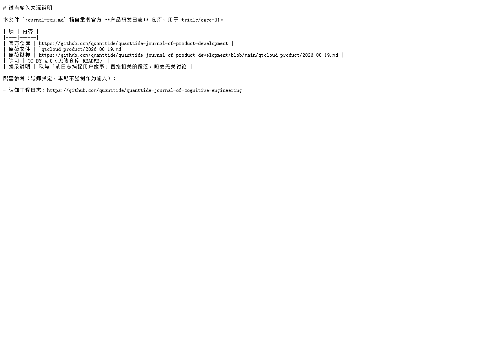

# 阶段 0 验收操作手册

> **给谁用：** 你自己（非计算机专业也行）  
> **要花多久：** 约 30～40 分钟，按顺序做，一项一项勾  
> **配套：** 本仓库 clone 下来后，在文件夹 `课题申请-product-requirement-loop` 里操作  

---

## 开篇：阶段 0 到底验收什么？

小王读完一堆官方资料，导师说：「别急着写代码。先证明三件事——**输入有据、目标清楚、以后你能验收 AI 产物**。」

这就是阶段 0。  
你不需要跑 Loop、不需要 API Key。你要验收的是：**地基打没打牢**。

做完本手册，你在 [阶段0快速验收清单.md](./阶段0快速验收清单.md) 上签字，阶段 0 就算过。

---

## 验收总表（先瞄一眼）

| 章节 | 你在验什么 | 对应以后哪块功能 |
|------|------------|------------------|
| 一 | 输入来自官方日志 | 试点 `journal-raw.md` → 阶段 4 的真实输入 |
| 二 | 产品云要什么 | 输出要对齐 `requirement.json` 三层 + 「用户要…」 |
| 三 | Agent 工程缺什么 | 为什么要补 `product-requirement` Loop |
| 四 | 验收页能用 | `review.html` → 阶段 4 人工确认界面 |
| 五 | 打叉能写原因 | revise 反馈点 → Loop 重跑依据 |
| 六 | Loop 骨架在 | `specification.yaml` → 阶段 2～4 的执行定义 |
| 七 | 自动检查脚本在 | `check.py` → 阶段 5 数值验收 |
| 八 | 阅读笔记可信 | `阶段0实现报告.md` → 你对资料的理解 |
| 九 | 自测报告全绿 | AI 工作流自测 → 交付前再跑一遍 |

---

## 一、输入：是不是官方日志，不是你瞎编的？

### 你要做什么

1. 浏览器打开官方原文：  
   https://github.com/quanttide/quanttide-journal-of-product-development/blob/main/qtcloud-product/2026-08-19.md  
2. 按 `Ctrl+F`，搜 **`捕捉用户故事`**  
3. 用记事本或 VS Code 打开本仓库：  
   `project/trials/case-01/input/journal-raw.md`  
4. 同样搜 **`捕捉用户故事`**  

### 你应该看到

- 官方网页和本地 `journal-raw.md` 里，**同一段话能对上**（本地是摘录，可以比原文短，但核心句在）。



再打开 `project/trials/case-01/input/SOURCE.md`，能看到：

- 官方仓库名：`quanttide-journal-of-product-development`  
- 原始文件路径：`qtcloud-product/2026-08-19.md`  
- 原始链接可点开  

### 这一步确定了什么功能？

| 功能 | 说明 |
|------|------|
| **可追溯输入** | 阶段 4 跑 Loop 时，读的就是这份 `journal-raw.md`，不是 AI 凭空编的需求 |
| **SOURCE.md 留痕** | 答辩时能说清「输入从哪来、哪年哪篇日志」 |

**□ 通过**　**□ 不通过**（不通过请记：哪里对不上）

---

## 二、产品云要什么：用户故事长什么样？

### 你要做什么

1. 打开图 1（产品云需求）：看下面截图，或打开  
   https://github.com/quanttide/quanttide-profile-of-product-development/blob/main/qtcloud-product/requirement.md  
2. 找到「捕捉用户故事」相关段落  
3. 再打开 `requirement.json`：  
   https://github.com/quanttide/quanttide-profile-of-product-development/blob/main/qtcloud-product/requirement.json  
4. 看几条 `text` 字段，是否都以 **「用户要」** 开头  

### 你应该看到


用一句话复述（可口头念给同学听）：

> 把研发日志里的乱话，整理成「用户要…」的清单，分活动、任务、故事三层，每条能指回原文，人改完再定稿。

### 这一步确定了什么功能？

| 功能 | 说明 |
|------|------|
| **输出格式目标** | 阶段 4 的 `stories.json` 必须对齐这个 JSON 结构 |
| **三层分级** | `level` 只能是 activity / task / story，不能自己发明分层 |
| **禁止编造** | 每条要有 `source_quote`，对应原文里的句子 |

**□ 通过**　**□ 不通过**

---

## 三、Agent 工程缺什么：为什么要做这个课题？

### 你要做什么

1. 打开 product-requirement 说明页（图 2）  
2. 打开 loops 目录（图 6）  
3. 对比：devops-code 有 `specification.yaml`（图 7），product-requirement 是否只有 `index.md`  

### 你应该看到


### 你要能答出两句话

1. **缺什么？** —— 没有 `specification.yaml`、没有 `implementation`、没有 `trials`  
2. **我们本期补什么？** —— 前两步：日志 → 故事 Markdown → 用户故事 JSON（不做 SQL、不做正式产品 UI）

### 这一步确定了什么功能？

| 功能 | 说明 |
|------|------|
| **课题合法性** | 不是空想题目，是官方档案里写了但没落地的 Loop |
| **执行器可复用** | 阶段 1 会复制 `implementation.py`，阶段 4 按同样反馈点跑 |

**□ 通过**　**□ 不通过**

---

## 四、验收页：左边原文、右边故事

### 你要做什么

1. 用 **Chrome / Edge** 打开（不要只靠 VS Code 预览）：  
   `project/trials/case-01/review.html`  
   - 路径技巧：在资源管理器里双击该文件，或把文件拖进浏览器  
2. 看左边是否加载出日志文字（不是「加载中…」）  
3. 看右边是否有示例故事列表  

### 你应该看到


### 这一步确定了什么功能？

| 功能 | 说明 |
|------|------|
| **非产品 UI 的验收界面** | 阶段 4 产出出来后，仍用这个页对照，不要求你懂 JSON |
| **左右对照** | 左边 `journal-raw.md`，右边 `stories`（阶段 4 后换成真实 output） |

**□ 通过**　**□ 不通过**（若左边空白：检查是否用浏览器打开；路径是否在 case-01 目录下）

---

## 五、关键词 + 打叉写原因（重点）

### 5.1 关键词高亮

1. 在 `review.html` 顶部，点 **`捕捉用户故事`**  
2. 看左边原文是否出现**黄色高亮**  


**确定功能：** 不熟悉全文时，用 [复核关键词卡-case01.md](./复核关键词卡-case01.md) 里的词快速定位。

**□ 通过**　**□ 不通过**

---

### 5.2 打叉必须写原因（含「不会写」的解法）

1. 点 **`✗ 编造`**  
2. 下方出现**现成句式**，点一句，或填一个词后点 **「拼成一句」**  
3. 点 **「生成 revise 指令」**  
4. 最下面输入框里应出现类似：  
   `revise:编造:右边写了「飞书」，原文没有`  


5. **故意不填原因**直接点生成 → 应提示你补原因（不能空着过）

**确定功能：**

| 功能 | 说明 |
|------|------|
| **反馈点 revise** | 阶段 4 Loop 根据这句话重跑当前步 |
| **revisions 留痕** | `accepted.json` 里记录 `code` + `comment` |
| **句式模板** | 你不会描述时，点现成句或填一个词即可 |

**□ 通过**　**□ 不通过**

---

### 5.3 通过即锁定

1. 点 **`✓ 通过（锁定本步）`**  
2. 底部指令变为 `ok`  

**确定功能：** 已确认的步骤/故事锁定，重跑时不反复问你（见 [人机确认操作指南.md](./人机确认操作指南.md)）。

**□ 通过**　**□ 不通过**

---

## 六、Loop 骨架：yaml 和 schema

### 你要做什么

1. 用 VS Code 打开 `project/product-requirement/specification.yaml`  
2. 确认能看到：`entry`、`exit`、`steps`（两步）、`feedback`、`loop`、`acceptance`  
3. 打开 `project/schemas/accepted.schema.json`，搜索 `revised`，确认 revised 必须带 `comment`  

### 不用读懂每一行，只要确认文件在、结构齐

**确定功能：**

| 文件 | 阶段 |
|------|------|
| `specification.yaml` | 阶段 2 定稿，阶段 4 执行依据 |
| `accepted.schema.json` | 阶段 5 定稿 JSON 校验 |
| `prompts/step1-story.md`、`step2-json.md` | 阶段 3 完善提示词 |

**□ 通过**　**□ 不通过**

---

## 七、check.py：以后的「红绿灯」

### 你要做什么

在终端（PowerShell）里：

```powershell
cd project
python check.py --help
```

应看到用法说明，不报错。

**确定功能：** 阶段 5 用同一脚本检查 `fabrication=0`、覆盖率 100% 等（门槛在 yaml 的 `acceptance` 里声明）。

**□ 通过**　**□ 不通过**（若报错：本机是否装了 Python 3.10+）

---

## 八、阅读笔记：阶段0实现报告

### 你要做什么

1. 打开 [阶段0实现报告.md](./阶段0实现报告.md)  
2. 浏览「读了什么、没读什么」  
3. 若 VS Code 里图不显示，用浏览器打开 [图文预览.html](./图文预览.html)  


4. 随机挑报告里一句**加粗判断**，去官方链接里 `Ctrl+F` 搜，看能否找到依据  

**确定功能：** 阶段 0 产出是「我读懂了、敢开工」，不是代码。

**□ 通过**　**□ 不通过**

---

## 九、工作流自测：AI 替你跑过一遍

### 你要做什么

```powershell
cd 课题申请-product-requirement-loop
python scripts/verify_stage0.py
```

应全部 `[PASS]`。再生成报告：

```powershell
python scripts/verify_stage0.py --write-report stage0-self-test-report.md
```

打开 `stage0-self-test-report.md`，确认没有 ✗。

**确定功能：** 交付前可重复跑，防止漏文件、漏截图、验收页缺功能。

**□ 通过**　**□ 不通过**

---

## 十、最终签字

全部勾选后：

1. 打开 [阶段0快速验收清单.md](./阶段0快速验收清单.md)  
2. 10 条表打勾 + 签字日期  
3. 在 [阶段0实现报告.md](./阶段0实现报告.md) 文末「执行人」填你的名字  


**阶段 0 完成。下一步：** [项目实现流程报告 — 阶段 1](./项目实现流程报告.md#阶段-1搭环境)

---

## 附录 A：验收不通过怎么办？

| 现象 | 可能原因 | 怎么办 |
|------|----------|--------|
| 图裂了 | `screenshots/` 缺 PNG | `cd screenshots` → `node capture_all.mjs` |
| review 左边空白 | 没用浏览器打开 | 用 Chrome 双击 `review.html` |
| verify_stage0 失败 | 缺文件 | 看 FAIL 行，从 GitHub 拉最新 |
| 不会写 revise 原因 | 正常 | 点现成句式或填一个词 |

在 `阶段0实现报告.md` 的「修订记录」里记一笔。

---

## 附录 B：和 Fork 的关系

阶段 0 **不要求** Fork 官方仓库也能验收（输入已摘录在本地）。  
阶段 1 起需要对照官方代码，请阅读 [FORK与仓库说明.md](./FORK与仓库说明.md)。
