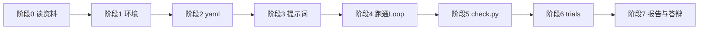

# 项目实现流程报告

**课题：** 产品需求梳理智能体（product-requirement Loop）  
**读者：** 你自己（按步骤做、按标准验）  
**配套资料：** 见 [资料清单.md](./资料清单.md)；代码骨架在 `project/` 目录  

---

## 总览：从地基到交付



| 阶段 | 做什么 | 产出 | 预计时间 |
|------|--------|------|----------|
| 0 | 读懂官方资料 | [阶段0实现报告.md](./阶段0实现报告.md) | 0.5 天 |
| 1 | 搭环境 | `.venv`、API Key | 0.5 天 |
| 2 | 定 Loop 定义 | `specification.yaml` | 1 天 |
| 3 | 写提示词 | `prompts/step1、step2` | 1 天 |
| 4 | 跑通主流程 | `output/` 全套产物 | 2～3 天 |
| 5 | 验收脚本 | `check.py` 全绿 | 1 天 |
| 6 | 试点 | `trial-report.md` | 1～2 天 |
| 7 | 整理提交 | README、可选 PR | 1 天 |

---

## 阶段 0：读懂资料（地基）

### 要做什么

1. 读产品云需求（图1、图10）——知道最终要「用户故事三层 + 人改」  
2. 读 product-requirement/index.md（图2）——知道 Loop 三步，本期做前两步  
3. 读 loops/README + devops-code yaml（图6、图7）——知道 Loop 怎么写  
4. 读 implementation.py（图8）——知道执行器怎么用  
5. 浏览 **产品研发日志** 仓库，熟悉日志长什么样  

### 官方输入来源（导师指定）

| 仓库 | 用途 |
|------|------|
| [quanttide-journal-of-product-development](https://github.com/quanttide/quanttide-journal-of-product-development) | **主输入**：产品研发日志，如 `qtcloud-product/2026-08-19.md` |
| [quanttide-journal-of-cognitive-engineering](https://github.com/quanttide/quanttide-journal-of-cognitive-engineering) | **配套参考**：认知工程思路（「讲故事」垫全局观） |

### 验收标准

- [ ] 能用自己的话说明：用户故事 = 「用户要…」+ activity/task/story 三层  
- [ ] 能指出 product-requirement 在仓库里缺什么（yaml、实现、trials）  
- [ ] 已 clone 或打开产品研发日志，看过至少 1 篇 `qtcloud-product/*.md`  

**完成后填写：** [阶段0实现报告.md](./阶段0实现报告.md)（故事版）  
**快速认可：** [阶段0快速验收清单.md](./阶段0快速验收清单.md)（5～10 分钟勾表）  
**逐步验收（推荐）：** [阶段0验收操作手册.md](./阶段0验收操作手册.md)（30～40 分钟，含截图与功能对照）  
**验收对照页：** `project/trials/case-01/review.html`（浏览器打开）

---

## 阶段 1：搭环境

### 要做什么

```bash
cd project
python -m venv .venv
.venv\Scripts\activate          # Windows
pip install pyyaml openai langgraph langgraph-checkpoint
```

1. 配置 `DEEPSEEK_API_KEY`（或 `~/.hermes/.env`，与官方 implementation.py 一致）  
2. 从官方仓库复制 `implementation.py` 到 `project/`，或 clone 整个 agent-engineering 仓库  

官方执行器：  
https://github.com/quanttide/quanttide-journal-of-product-development  

### 验收标准

- [ ] `python -c "import yaml, langgraph"` 无报错  
- [ ] `python implementation.py --help` 或 `python check.py --help` 能运行  
- [ ] API Key 已配置（或明确用 mock 模式并记录在 README）  

---

## 阶段 2：定 Loop 定义（承重结构）

### 要做什么

编辑 `project/product-requirement/specification.yaml`（骨架已提供）。

要点：

- 字段对齐图7（devops-code 模板）  
- 第一步改名「整理需求故事」——先讲故事再结构化（导师方法）  
- `acceptance` 块写明数值门槛（老师建议）  

### 验收标准

- [ ] yaml 能被 `yaml.safe_load` 解析  
- [ ] 含 `entry` / `exit` / `steps` / `feedback` / `loop` / `metrics` / `acceptance`  
- [ ] `python implementation.py trials/case-01 --dry-run` 能打印步骤列表（若已接执行器）  

---

## 阶段 3：写提示词（讲故事 → 抽故事）

### 要做什么

1. 完善 `prompts/step1-story.md`：把乱日志整理成 **一件完整的事**  
2. 完善 `prompts/step2-json.md`：从故事抽 JSON，禁止编造  

**导师要点：** AI 弱于产品全局观 → Step1 用「讲故事」垫一层，再进结构化。

### 用小王的日志试跑（手动）

```bash
cd trials/case-01
# 把 journal-raw.md 内容代入 step1 提示词，调 LLM，保存 output/requirement-story.md
# 再代入 step2，保存 output/stories.json
```

### 验收标准

- [ ] Step1 产出读起来是「一件事」，不是条目堆砌  
- [ ] Step1 含「原文摘录」块  
- [ ] Step2 每条 `text` 以「用户要」开头  
- [ ] 每条有 `source_quote`，且能在 `journal-raw.md` 中找到  

---

## 阶段 4：跑通 Loop 主流程（盖主楼）

### 要做什么

**路径 A（推荐）：** 用官方 `implementation.py` + 你的 yaml  

```bash
cd trials/case-01
python ../../implementation.py . --task "$(type input\journal-raw.md)"
```

**路径 B：** 手动执行 + 在反馈点输入 `ok` / `revise: …`

流程：

1. Step1 → `output/requirement-story.md` → **等人** → 可 revise  
2. Step2 → `output/stories.json` → **等人** → 可 revise  
3. 人确认 → 生成 `output/accepted.json`（含 `approved` + `revisions`）  

### accepted.json 必须包含（老师建议）

```json
{
  "meta": { "finalized_at": "...", "finalized_by": "你的名字" },
  "stories": [
    {
      "id": "s1",
      "approved": true,
      "revisions": [
        { "round": 1, "action": "created", "at": "..." },
        { "round": 2, "action": "revised", "comment": "...", "at": "..." },
        { "round": 2, "action": "approved", "at": "..." }
      ]
    }
  ],
  "review": { "approved": true, "approver": "你的名字", "approved_at": "..." }
}
```

结构约束见 `schemas/accepted.schema.json`。

### 验收标准

- [ ] 全流程至少触发 **1 次**反馈点（有 revise 更好）  
- [ ] `output/` 下有 requirement-story.md、stories.json、accepted.json  
- [ ] accepted.json 每条 `approved: true` 且 `revisions` 非空  
- [ ] `review.approved === true`  

---

## 阶段 5：自动验收 check.py（补丁层）

### 要做什么

```bash
cd project
python check.py trials/case-01/output/stories.json --source trials/case-01/input/journal-raw.md --write-uncovered trials/case-01/output/uncovered.md
python check.py trials/case-01/output/accepted.json --source trials/case-01/input/journal-raw.md --strict
```

### 验收门槛（申请声明，必须全过）

| 检查项 | 数值标准 |
|--------|----------|
| 编造条数 | **= 0** |
| source_quote 通过率 | **= 100%** |
| 句覆盖率 | **= 100%** |
| 未覆盖句 | 写入 `uncovered.md`，且 `review.comments` 有人工确认说明 |

### 验收标准

- [ ] 两条 check 命令退出码均为 **0**  
- [ ] 终端输出「全部验收门槛通过」  

---

## 阶段 6：trials 试点（证明有用）

### 要做什么

1. 复制 `trial-report.template.md` → `trial-report.md`  
2. 填写 **实测数据**（不是申请里的门槛数字）  
3. 可选：同一段 `journal-raw.md`，用「一次性 prompt 直接出 JSON」跑基线，对比编造条数、纠偏次数  

对照官方图9 记录 metrics：rounds、time、corrections、rework。

### 验收标准

- [ ] trial-report.md 已填写，区分「门槛」与「实测」两栏  
- [ ] 实测满足全部门槛  
- [ ] 有/无 Loop 对比表（至少填 Loop 侧；基线可选）  

---

## 阶段 7：整理与提交

### 要做什么

1. 完善 `project/README.md`  
2. 更新 `课题申请.md` 若设计有变  
3. 打包：`课题申请.md` + `项目实现流程报告.md` + `project/` + `screenshots/`  
4. （可选）向 `quanttide-profile-of-agent-engineering` 提 PR  

### 验收标准

- [ ] 他人只看 README 能复跑 case-01  
- [ ] 资料清单中链接均可打开  
- [ ] 答辩能演示：输入日志 → 出 JSON → check 全绿 → 展示 accepted.json 里的 revisions  

---

## 常见问题

### Q：研发日志必须用哪篇？

优先用产品研发日志里与产品云相关的条目，如 `qtcloud-product/2026-08-19.md`。case-01 已摘录一段，见 `input/SOURCE.md`。

### Q：和产品云怎么对接？

本期：**文件对接**——`accepted.json` 字段对齐 `requirement.json` 三层。不做 API。录用后再接产品云后端。

### Q：实验结果写在哪？

**门槛**写课题申请 / specification.yaml；**实测**只写 trial-report.md。不要混。

---

## 附：目录检查清单

```
课题申请-product-requirement-loop/
├── 课题申请.md
├── 项目实现流程报告.md          ← 本文件
├── 资料清单.md
├── screenshots/
└── project/
    ├── product-requirement/specification.yaml
    ├── check.py
    ├── schemas/accepted.schema.json
    └── trials/case-01/
        ├── input/journal-raw.md
        ├── input/SOURCE.md
        ├── prompts/
        ├── trial-report.template.md
        └── output/               ← 你跑出来后才有
```
